---
## Author
author:
  name: Швецов Михаил Романович
  degrees: Student
  email: 1132236100@rudn.ru
  affiliation:
    - name: Российский университет дружбы народов
      country: Российская Федерация
      postal-code: 117198
      city: Москва
      address: ул. Миклухо-Маклая, д. 6
## Title
title: Лабораторная работа 1
subtitle: Создание стенда
license: CC BY
date: today
date-format: "YYYY-MM-DD" # Example: 2025-09-06
---

# Информация

## Докладчик

:::::::::::::: {.columns align=center}
::: {.column width="70%"}

  * Швецов Михаил Романович
  * студент НКНбд-01-23
  * Российский университет дружбы народов им. П. Лумумбы
  * [1132236100@rudn.ru](mailto:1132236100@rudn.ru)
  * <https://DarkkLord.github.io/ru/>

:::
::: {.column width="30%"}

:::
::::::::::::::

# Вводная часть

## Актуальность

- Данная лабораторная работа даёт возможность подробно разобраться в подготовке рабочего пространства для выполнения лабораторных работ.

::: notes
- Почему именно *структура* презентации важна.
- Время: не более 1 минуты на этот слайд.
:::

## Объект исследования

- Создание стенда для лабораторны работ

## Цели и задачи

- Цель:
    - Создать качественное и удобное для выполнения лабораторных работ рабочее пространство.
- Задачи:
    - Подготовить стенд для лаборатроных работ.
    - Выполнить предложеный код и скомпелировать ответ в Markdown.

# Непосредственное выполнение

## Скриншоты с пояснениями к действиям 

Базовая настройка git (рис. -@fig-001).

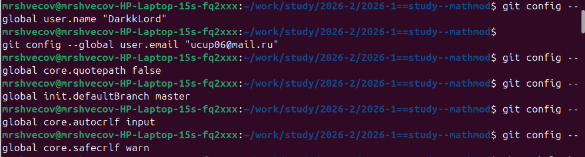{#fig-001 width=50%}

## Скриншоты с пояснениями к действиям 

Базовая настройка gh (рис. -@fig-002).

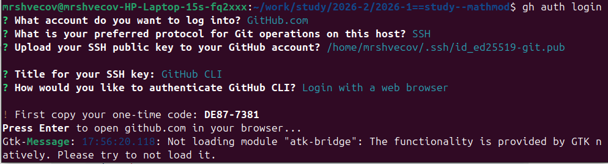{#fig-002 width=50%}

## Скриншоты с пояснениями к действиям 

Создание ключа SSh (рис. -@fig-003).

{#fig-003 width=50%}

## Скриншоты с пояснениями к действиям 

Добавляем ключ в агент (рис. -@fig-004).

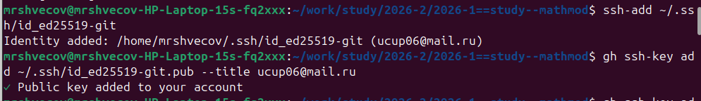{#fig-004 width=50%}

## Скриншоты с пояснениями к действиям 

Добавляем ключ в учётную запись github (рис. -@fig-005).

{#fig-005 width=50%}

## Скриншоты с пояснениями к действиям 

Создание ключей pgp (рис. -@fig-006).

{#fig-006 width=50%}

## Скриншоты с пояснениями к действиям 

Добавление PGP ключа на хостинг (рис. -@fig-007).

{#fig-007 width=50%}

## Скриншоты с пояснениями к действиям 

Клонируем репозиторий (рис. -@fig-008).

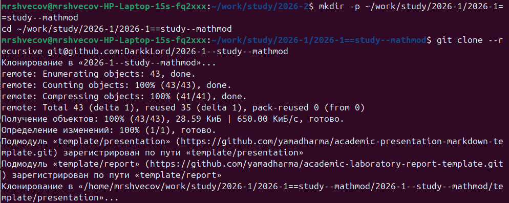{#fig-008 width=50%}

## Скриншоты с пояснениями к действиям 

Структурируем шаблон (рис. -@fig-009).

{#fig-009 width=50%}

## Скриншоты с пояснениями к действиям 

Настраиваем каталог курса (рис. -@fig-0010).

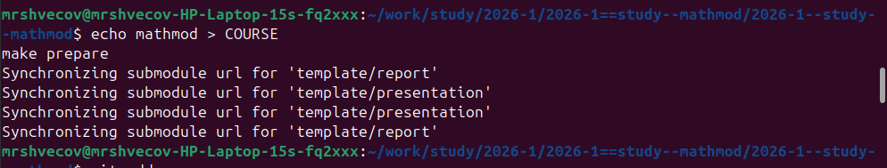{#fig-0010 width=50%}

## Скриншоты с пояснениями к действиям 

Отправьте файлы на сервер: (рис. -@fig-0011).

{#fig-0011 width=50%}

## Скриншоты с пояснениями к действиям 

Отправьте файлы на сервер: (рис. -@fig-0012).

{#fig-0012 width=50%}

## Скриншоты с пояснениями к действиям 

Инициализируем git-flow, проверяем, что мы на ветке develop, загружаем весь репозиторий в хранилище, создадим релиз с версией 1.0.0 (рис. -@fig-0013).

{#fig-0013 width=50%}

## Скриншоты с пояснениями к действиям 

Создадим журнал изменений, добавим журнал изменений в индекс, зальём релизную ветку в основную ветку (рис. -@fig-0014).

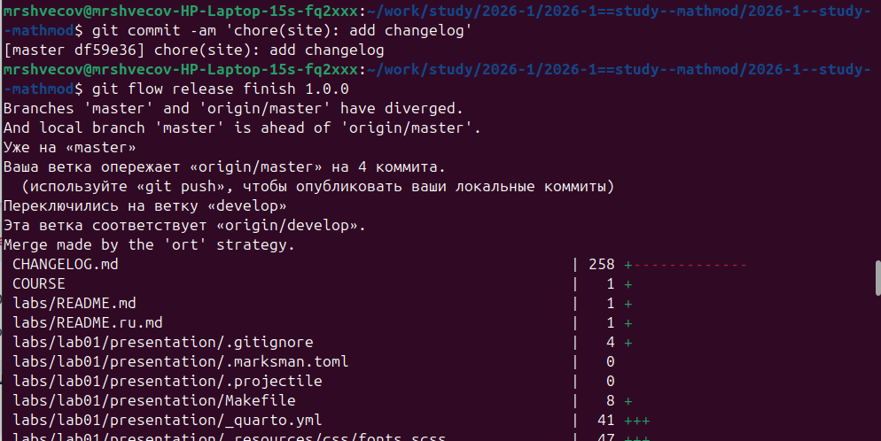{#fig-0014 width=50%}

## Скриншоты с пояснениями к действиям 

Создание проекта DrWatson для лабораторных работ (рис. -@fig-0015).

{#fig-0015 width=50%}

## Скриншоты с пояснениями к действиям 

Добавление необходимых пакетов (рис. -@fig-0016).

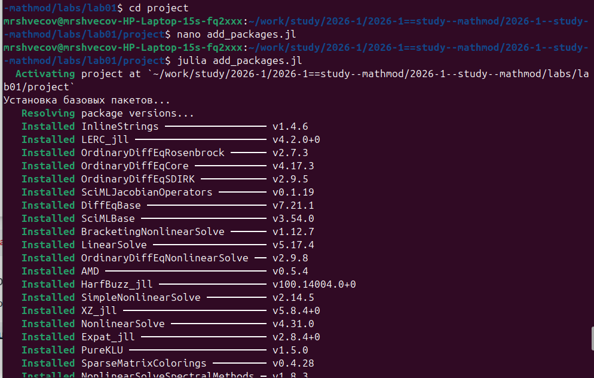{#fig-0016 width=50%}

## Скриншоты с пояснениями к действиям 

Проверка установки (рис. -@fig-0017).

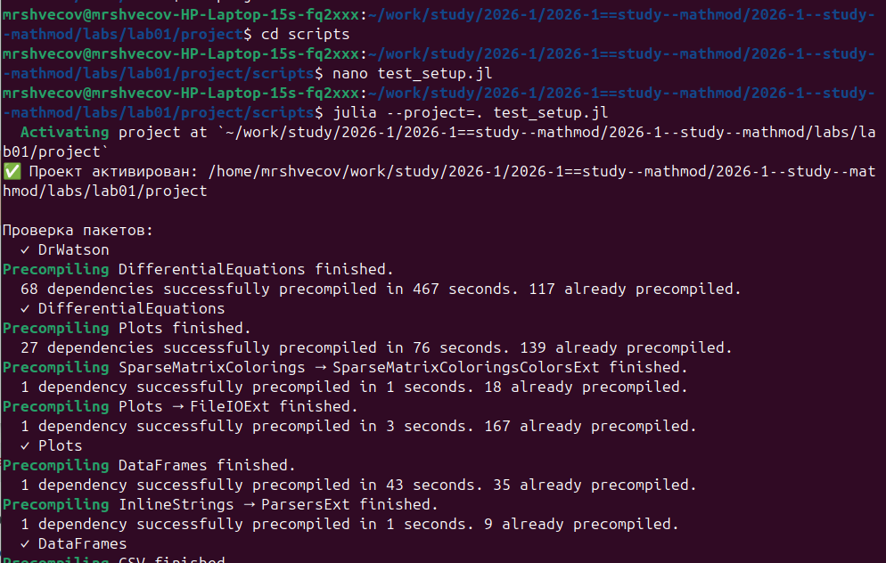{#fig-0017 width=50%}

## Скриншоты с пояснениями к действиям 

Проверка установки (рис. -@fig-0018).

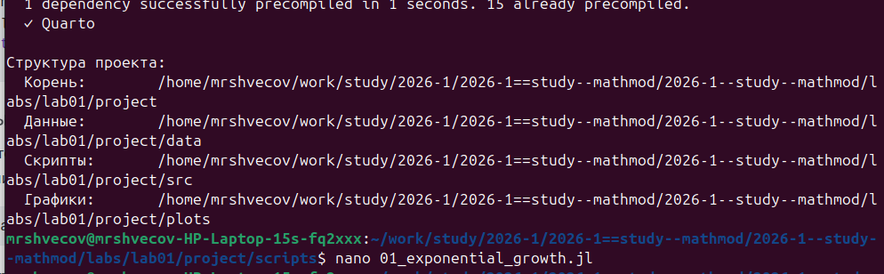{#fig-0018 width=50%}

## Скриншоты с пояснениями к действиям 

Реализация модели экпоненциального роста (рис. -@fig-0019).

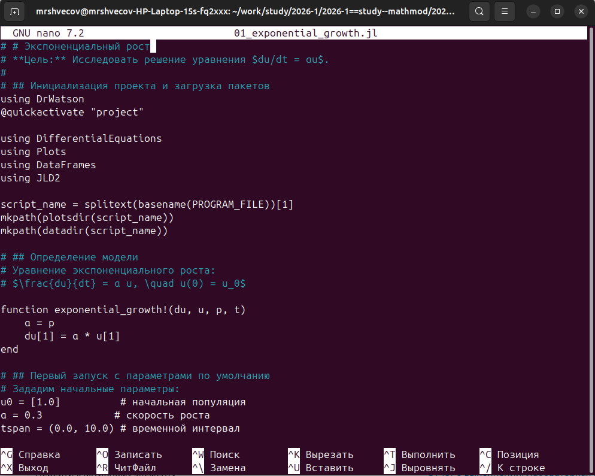{#fig-0019 width=50%}

## Скриншоты с пояснениями к действиям 

Результат выполнения (рис. -@fig-0020).

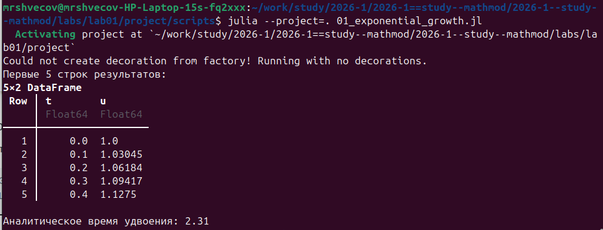{#fig-0020 width=50%}

## Скриншоты с пояснениями к действиям 

Литературная реализация модели (рис. -@fig-0021).

{#fig-0021 width=50%}

## Скриншоты с пояснениями к действиям 

Создание производных форматов (рис. -@fig-0022).

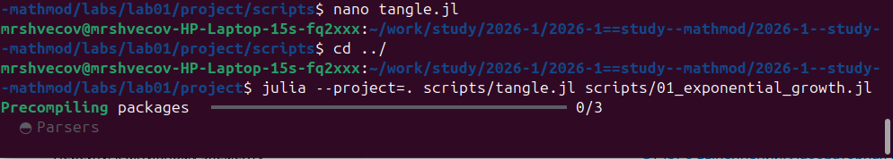{#fig-0022 width=50%}

## Скриншоты с пояснениями к действиям 

Создание производных форматов (рис. -@fig-0023).

{#fig-0023 width=50%}

## Скриншоты с пояснениями к действиям 

Реализация модели с параметрами (рис. -@fig-0024).

{#fig-0024 width=50%}

## Скриншоты с пояснениями к действиям 

Реализация модели с параметрами (рис. -@fig-0025).

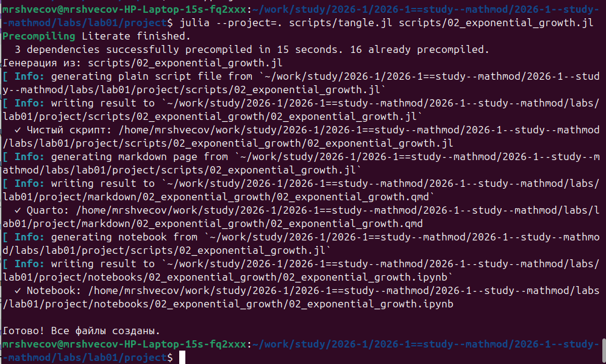{#fig-0025 width=50%}

# Заключение

## Главный вывод

- Достигнута поставленная цель;
- Созданы репозитории, рабочаа пространство и выполнено задание из лабораторной работы;

