---
## Author
author:
  name: Швецов Михаил Романович
  degrees: Student
  email: 1132236100rudn.ru
  affiliation:
    - name: Российский университет дружбы народов
      country: Российская Федерация
      postal-code: 117198
      city: Москва
      address: ул. Миклухо-Маклая, д. 6

## Title
title: "Отчёт по лабораторной работе 1"
subtitle: "Подготовка стенда"
license: "CC BY"
abstract: |
  В данном отчёте представлены результаты выполнения лабораторной работы по теме Подготовка стенда

  Описаны использованные методы, полученные экспериментальные данные и их анализ.

  Сделаны выводы о достижении поставленной цели.
keywords: [лабораторная работа, шаблон, Markdown, Pandoc]
---

# Введение

## Актуальность

В данной работе мы подготовили стенд для выполнения заданий, скопировали репозиторий по шаблону и создали рабочее пространство. 

## Цель работы

Целью данной работы является подготовка рабочего пространства.

## Задачи

Изучить теоретическую часть и по аналогии подготовить пространство для лабораторных работы курса. 

## Объект и предмет исследования

В данном случае мы изучаем то, как подготовить рабочее пространство для выполнения и сдачи лабораторных работ курса. 

## Методы исследования

Основным методом является изучение и наработака практического навыка. 

# Теоретическая часть

Теоретическую часть мы можем изучить в файле задания лабораторной раюоты в соответствующем разделе ТУИС. 

# Выполнение лабораторной работы

Базовая настройка git (рис. -@fig-001).

{#fig-001 width=70%}

Базовая настройка gh (рис. -@fig-002).

{#fig-002 width=70%}

Создание ключа SSh (рис. -@fig-003).

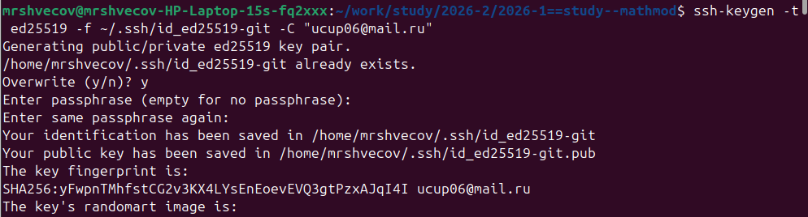{#fig-003 width=70%}

Добавляем ключ в агент (рис. -@fig-004).

{#fig-004 width=70%}

Добавляем ключ в учётную запись github (рис. -@fig-005).

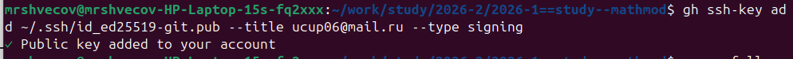{#fig-005 width=70%}

Создание ключей pgp (рис. -@fig-006).

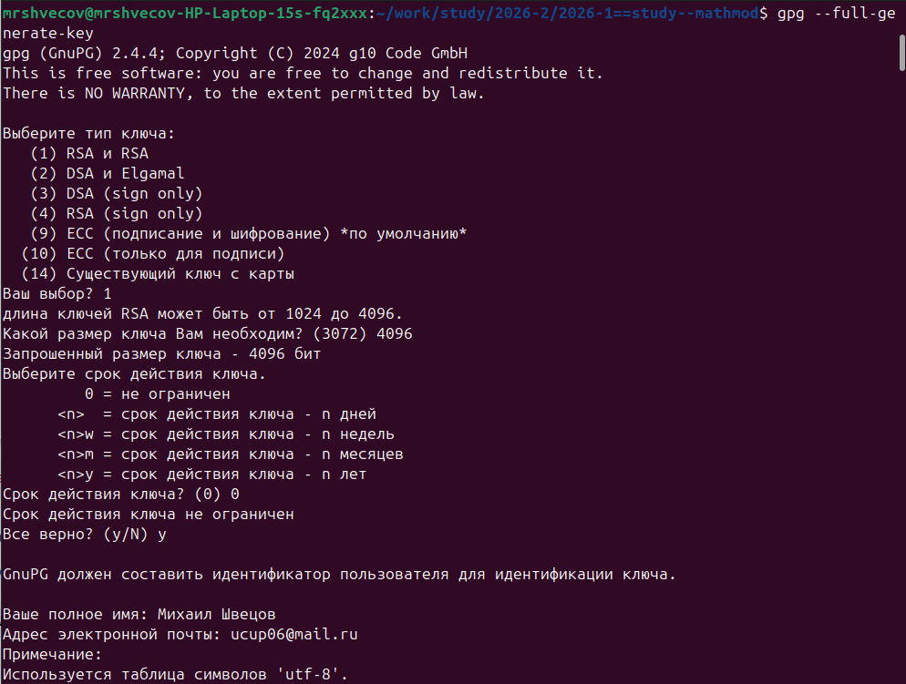{#fig-006 width=70%}

Добавление PGP ключа на хостинг (рис. -@fig-007).

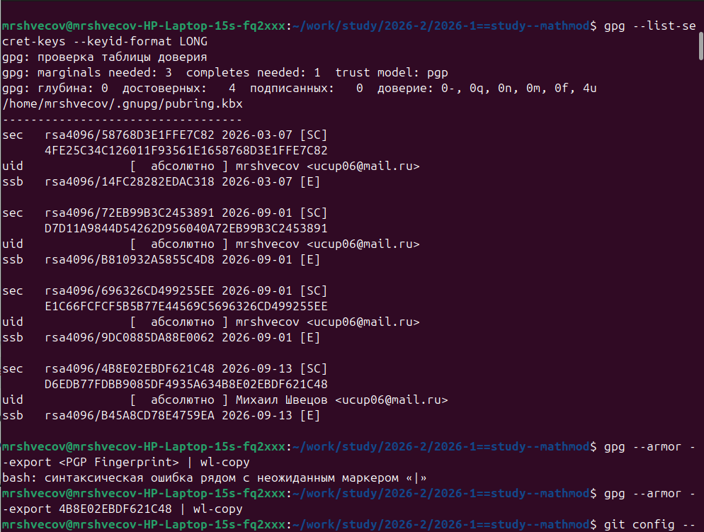{#fig-007 width=70%}

Клонируем репозиторий (рис. -@fig-008).

{#fig-008 width=70%}

Структурируем шаблон (рис. -@fig-009).

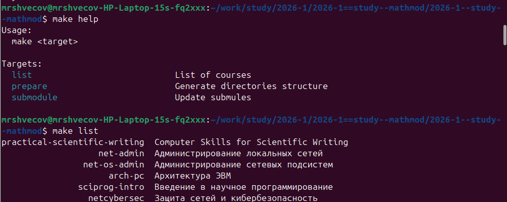{#fig-009 width=70%}

Настраиваем каталог курса (рис. -@fig-0010).

{#fig-0010 width=70%}

Отправьте файлы на сервер: (рис. -@fig-0011).

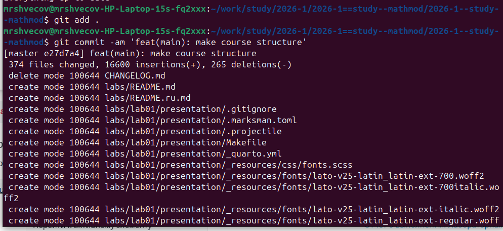{#fig-0011 width=70%}

Отправьте файлы на сервер: (рис. -@fig-0012).

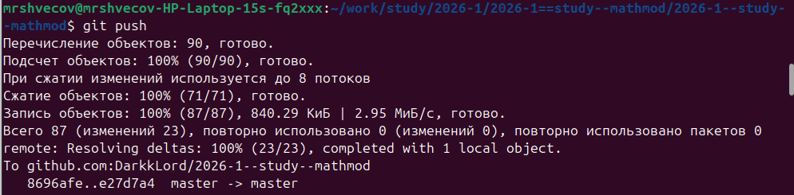{#fig-0012 width=70%}

Инициализируем git-flow, проверяем, что мы на ветке develop, загружаем весь репозиторий в хранилище, создадим релиз с версией 1.0.0 (рис. -@fig-0013).

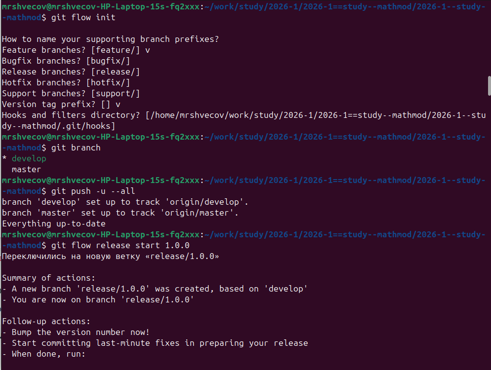{#fig-0013 width=70%}

Создадим журнал изменений, добавим журнал изменений в индекс, зальём релизную ветку в основную ветку (рис. -@fig-0014).

{#fig-0014 width=70%}

Создание проекта DrWatson для лабораторных работ (рис. -@fig-0015).

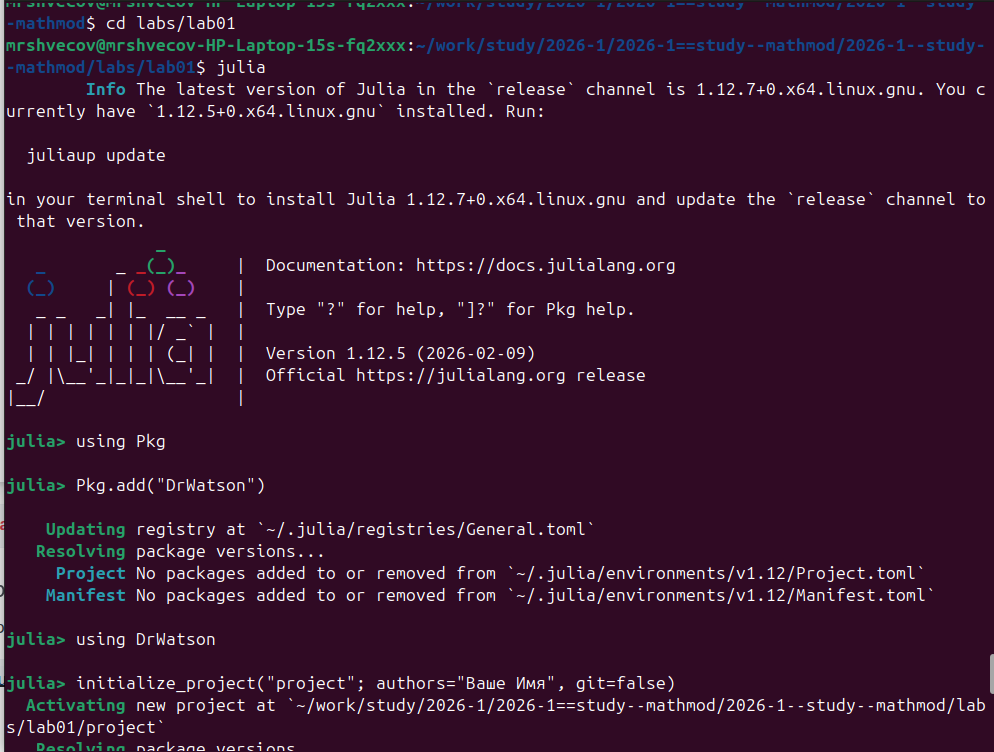{#fig-0015 width=70%}

Добавление необходимых пакетов (рис. -@fig-0016).

{#fig-0016 width=70%}

Проверка установки (рис. -@fig-0017).

{#fig-0017 width=70%}

Проверка установки (рис. -@fig-0018).

{#fig-0018 width=70%}

Реализация модели экпоненциального роста (рис. -@fig-0019).

{#fig-0019 width=70%}

Результат выполнения (рис. -@fig-0020).

{#fig-0020 width=70%}

Литературная реализация модели (рис. -@fig-0021).

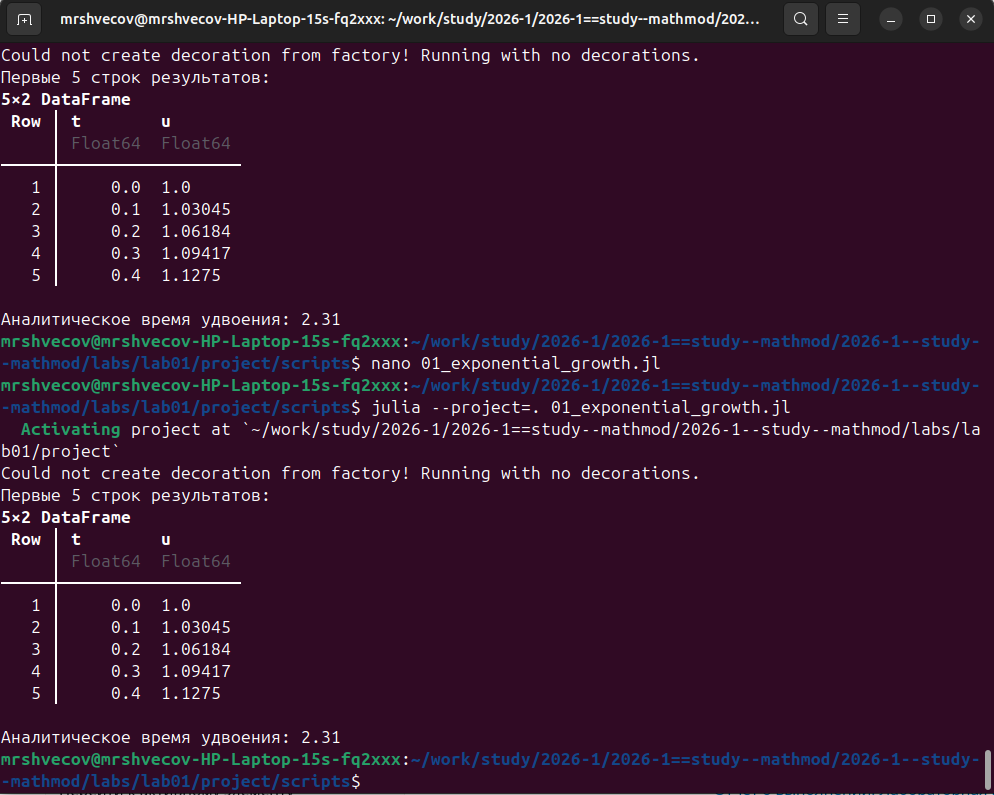{#fig-0021 width=70%}

Создание производных форматов (рис. -@fig-0022).

{#fig-0022 width=70%}

Создание производных форматов (рис. -@fig-0023).

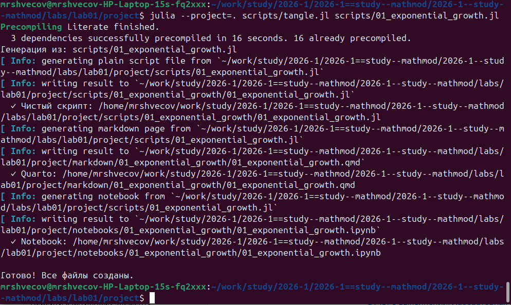{#fig-0023 width=70%}

Реализация модели с параметрами (рис. -@fig-0024).

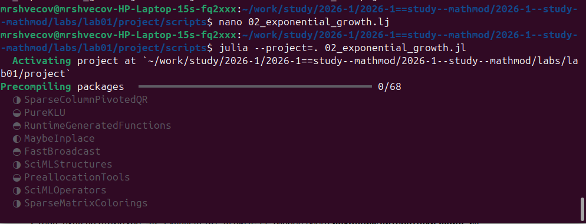{#fig-0024 width=70%}

Реализация модели с параметрами (рис. -@fig-0025).

{#fig-0025 width=70%}

# Заключение

- Достигнута поставленная цель;
- Созданы репозитории, рабочаа пространство и выполнено задание из лабораторной работы;

# Список литературы {.unnumbered}

::: {#refs}

1. Knuth D.E. Literate Programming // The Computer Journal. Oxford University Press (OUP), 1984. Т. 27, № 2. С. 97–111.
2. Schulte E. и др. A Multi-Language Computing Environment for Literate Programming and Reproducible Research // Journal of Statistical Software. Foundation for Open Access Statistic, 2012. Т. 46, № 3.
3. Kery M.B. и др. The Story in the Notebook // Proceedings of the 2018 CHI Conference on Human Factors in Computing Systems. ACM, 2018. С. 1–11.

:::

\appendix

# Приложения {.appendix}

Приложение А. Листинг программы.


