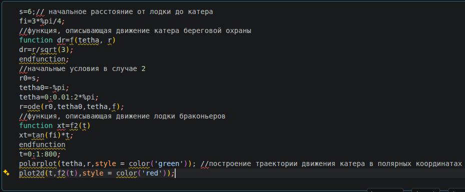
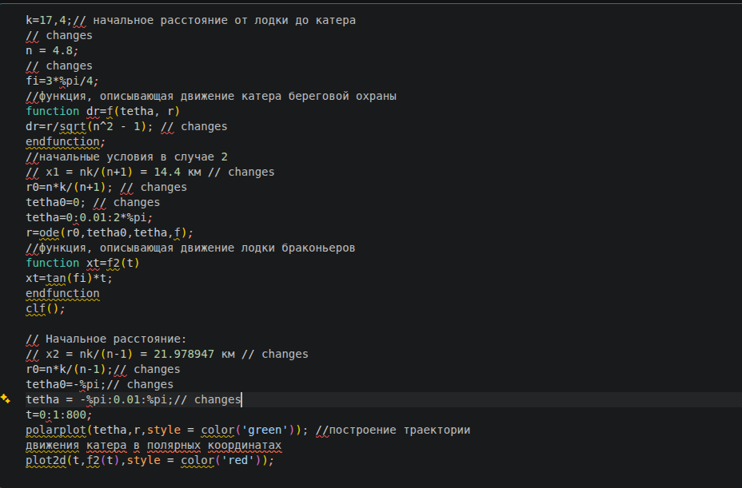
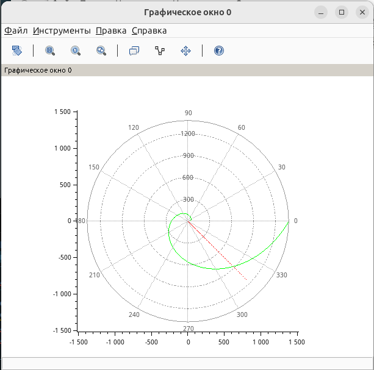
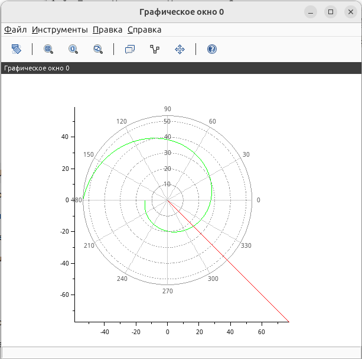

---
## Author
author:
  name: Швецов Михаил Романович
  degrees: Student
  email: 1132236100rudn.ru
  affiliation:
    - name: Российский университет дружбы народов
      country: Российская Федерация
      postal-code: 117198
      city: Москва
      address: ул. Миклухо-Маклая, д. 6

## Title
title: "Отчёт по лабораторной работе 1"
subtitle: "Подготовка стенда"
license: "CC BY"
abstract: |
  В данном отчёте представлены результаты выполнения лабораторной работы по теме "Задача о погоне"
  Описаны использованные методы, полученные экспериментальные данные и их анализ.

  Сделаны выводы о достижении поставленной цели.
keywords: [лабораторная работа, шаблон, Markdown, Pandoc]
---

# Введение

## Актуальность

В данной работе мы решили задачу о погоне по предоставленному примеру решения. 

## Цель работы

Решить представленную зачаду в указанном варианте.

## Задачи

Вариант 41
  На море в тумане катер береговой охраны преследует лодку браконьеров.
  Через определенный промежуток времени туман рассеивается, и лодка
  обнаруживается на расстоянии 17,4 км от катера. Затем лодка снова скрывается в
  тумане и уходит прямолинейно в неизвестном направлении. Известно, что скорость
  катера в 4,8 раза больше скорости браконьерской лодки.
    1. Запишите уравнение, описывающее движение катера, с начальными
      условиями для двух случаев (в зависимости от расположения катера
      относительно лодки в начальный момент времени).
    2. Постройте траекторию движения катера и лодки для двух случаев.
    3. Найдите точку пересечения траектории катера и лодки

## Объект и предмет исследования

Решение задачи на погоню, вариант 41. 

## Методы исследования

Основным методом является изучение теоретического материала и наработака практического навыка. 

# Теоретическая часть

Теоретическую часть мы можем изучить в файле задания лабораторной раюоты в соответствующем разделе ТУИС. 

# Выполнение лабораторной работы

## Постановка задачи

1. Примем за \(t_0=0\) момент обнаружения лодки браконьеров. Начало координат совместим с местом нахождения лодки браконьеров в момент обнаружения:

$$
x_{\text{л}}(0)=0.
$$

Катер береговой охраны в этот момент находится на расстоянии

$$
x_{\text{к}}(0)=k=17.4\text{ км}
$$

от лодки браконьеров.

Скорость лодки браконьеров обозначим через \(v\). Скорость катера береговой охраны в \(n=4.8\) раз больше:

$$
v_{\text{к}}=nv=4.8v.
$$

2. Введём полярные координаты. Полюсом будем считать точку обнаружения лодки браконьеров. Полярная ось \(r\) проходит через точку нахождения катера береговой охраны в начальный момент времени.

Таким образом, в начальный момент положение катера задаётся радиусом \(r\), а положение лодки соответствует полюсу:

$$
r_{\text{л}}=0.
$$

3. Траектория катера должна быть такой, чтобы катер и лодка в каждый момент времени находились на одинаковом расстоянии от полюса. Поэтому сначала катер береговой охраны движется прямолинейно, пока его расстояние от полюса не станет равным расстоянию лодки.

После этого катер изменяет направление движения и начинает двигаться вокруг полюса, удаляясь от него с той же радиальной скоростью, что и лодка браконьеров.

4. Для определения расстояния \(x\), после которого катер начинает движение вокруг полюса, рассмотрим два возможных начальных положения.

Пусть через некоторое время \(t\) катер и лодка окажутся на одинаковом расстоянии \(x\) от полюса.

### Первый случай

Лодка за время \(t\) проходит расстояние \(x\), поэтому

$$
t=\frac{x}{v}.
$$

Катер проходит расстояние \(k-x\), поэтому

$$
t=\frac{k-x}{nv}.
$$

Так как время одно и то же, получаем:

$$
\frac{x}{v}=\frac{k-x}{nv}.
$$

После сокращения на \(v\):

$$
x=\frac{k-x}{n}.
$$

Отсюда:

$$
nx=k-x,
$$

$$
(n+1)x=k,
$$

$$
\boxed{x_1=\frac{nk}{n+1}}.
$$

Для варианта 41:

$$
x_1=
\frac{4.8\cdot17.4}{4.8+1}
=
\boxed{14.4\text{ км}}.
$$

### Второй случай

Во втором случае расстояние, пройденное катером, равно \(k+x\). Поэтому:

$$
\frac{x}{v}=\frac{k+x}{nv}.
$$

После сокращения на \(v\):

$$
x=\frac{k+x}{n}.
$$

Отсюда:

$$
nx=k+x,
$$

$$
(n-1)x=k,
$$

$$
\boxed{x_2=\frac{nk}{n-1}}.
$$

Для варианта 41:

$$
x_2=
\frac{4.8\cdot17.4}{4.8-1}
=
\frac{83.52}{3.8}
\approx
\boxed{21.979\text{ км}}.
$$

Таким образом, задача рассматривается для двух случаев с начальными расстояниями:

$$
\boxed{x_1=14.4\text{ км}},
\qquad
\boxed{x_2\approx21.979\text{ км}}.
$$

5. После того как катер береговой охраны окажется на одном расстоянии от полюса с лодкой, он должен изменить прямолинейную траекторию и начать двигаться вокруг полюса, удаляясь от него с радиальной скоростью лодки.

Скорость катера разложим на две составляющие:

* \(v_r\) — радиальная скорость;
* \(v_\tau\) — тангенциальная скорость.

Радиальная скорость показывает, с какой скоростью катер удаляется от полюса:

$$
v_r=\frac{dr}{dt}.
$$

Поскольку радиальная скорость катера должна быть равна скорости лодки \(v\), получаем:

$$
\boxed{\frac{dr}{dt}=v}.
$$

Тангенциальная скорость связана с угловой скоростью следующим соотношением:

$$
v_\tau=r\frac{d\theta}{dt}.
$$

Полная скорость катера равна \(nv=4.8v\). Поэтому из разложения скорости получаем:

$$
v_{\text{к}}^2=v_r^2+v_\tau^2.
$$

Подставляя \(v_{\text{к}}=4.8v\) и \(v_r=v\):

$$
(4.8v)^2=v^2+v_\tau^2.
$$

Следовательно:

$$
v_\tau^2=(4.8^2-1)v^2,
$$

$$
v_\tau=\sqrt{4.8^2-1}\,v,
$$

$$
\boxed{v_\tau=\sqrt{22.04}\,v}.
$$

Так как

$$
v_\tau=r\frac{d\theta}{dt},
$$

получаем:

$$
\boxed{r\frac{d\theta}{dt}=\sqrt{22.04}\,v}.
$$

6. Таким образом, решение исходной задачи сводится к системе двух дифференциальных уравнений:

$$
\begin{cases}
\dfrac{dr}{dt}=v,\\[6pt]
r\dfrac{d\theta}{dt}=\sqrt{22.04}\,v.
\end{cases}
$$

Для первого случая начальные условия имеют вид:

$$
\boxed{
\begin{cases}
r(0)=x_1=14.4,\\
\theta(0)=0.
\end{cases}}
$$

Для второго случая:

$$
\boxed{
\begin{cases}
r(0)=x_2\approx21.979,\\
\theta(0)=-\pi.
\end{cases}}
$$

Исключим время \(t\). Для этого разделим первое уравнение системы на второе:

$$
\frac{dr/dt}{d\theta/dt}
=
\frac{v}{\sqrt{22.04}\,v/r}.
$$

После сокращения на \(v\):

$$
\boxed{\frac{dr}{d\theta}=\frac{r}{\sqrt{22.04}}}.
$$

Это дифференциальное уравнение описывает траекторию движения катера береговой охраны в полярных координатах.

Его общее решение имеет вид:

$$
\frac{dr}{r}=\frac{d\theta}{\sqrt{22.04}},
$$

$$
\ln r=\frac{\theta}{\sqrt{22.04}}+C,
$$

$$
\boxed{r=C e^{\theta/\sqrt{22.04}}}.
$$

С учётом начальных условий получаем две траектории:

### Первый случай

$$
\boxed{
r_1(\theta)=
14.4e^{\theta/\sqrt{22.04}}
}
$$

при

$$
\theta_0=0.
$$

### Второй случай

$$
\boxed{
r_2(\theta)=
21.979e^{(\theta+\pi)/\sqrt{22.04}}
}
$$

при

$$
\theta_0=-\pi.
$$

Полученные функции используются для построения траекторий катера береговой охраны в полярных координатах.

# Скриншоты выполнения лабораторной работы

Исходный код решения, предоставленный как пример (рис. -@fig-001).

{#fig-001 width=70%}

Готовый код решения зачачи, созданый на основе исходного (рис. -@fig-002).

{#fig-002 width=70%}

Получение графика из предоставленного решения (рис. -@fig-003).

{#fig-003 width=70%}

Получение графика из модифицированного кода (рис. -@fig-004).

{#fig-004 width=70%}

# Заключение

- Достигнута поставленная цель;
- Решена предоставленная задача, а также изчуна теоретическая часть.

# Список литературы {.unnumbered}

::: {#refs}

1. Knuth D.E. Literate Programming // The Computer Journal. Oxford University Press (OUP), 1984. Т. 27, № 2. С. 97–111.
2. Schulte E. и др. A Multi-Language Computing Environment for Literate Programming and Reproducible Research // Journal of Statistical Software. Foundation for Open Access Statistic, 2012. Т. 46, № 3.
3. Kery M.B. и др. The Story in the Notebook // Proceedings of the 2018 CHI Conference on Human Factors in Computing Systems. ACM, 2018. С. 1–11.

:::

\appendix

# Приложения {.appendix}

Приложение А. Листинг кода для решения задачи (SciLab).

```

k=17,4;// начальное расстояние от лодки до катера 

// changes

n = 4.8;

// changes

fi=3*%pi/4;

//функция, описывающая движение катера береговой охраны

function dr=f(tetha, r)

dr=r/sqrt(n^2 - 1); // changes

endfunction;

//начальные условия в случае 2

// x1 = nk/(n+1) = 14.4 км // changes

r0=n*k/(n+1); // changes

tetha0=0; // changes

tetha=0:0.01:2*%pi;


r=ode(r0,tetha0,tetha,f);

//функция, описывающая движение лодки браконьеров

function xt=f2(t) 

xt=tan(fi)*t; 

endfunction

clf();

// Начальное расстояние:

// x2 = nk/(n-1) = 21.978947 км // changes

r0=n*k/(n-1);// changes

tetha0=-%pi;// changes

tetha = -%pi:0.01:%pi;// changes

t=0:1:800;

polarplot(tetha,r,style = color('green')); //построение траектории

движения катера в полярных координатах

plot2d(t,f2(t),style = color('red'));  

```
