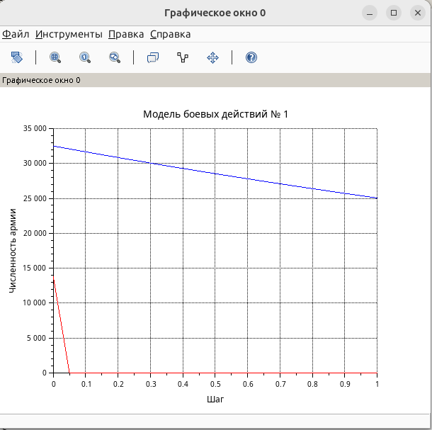
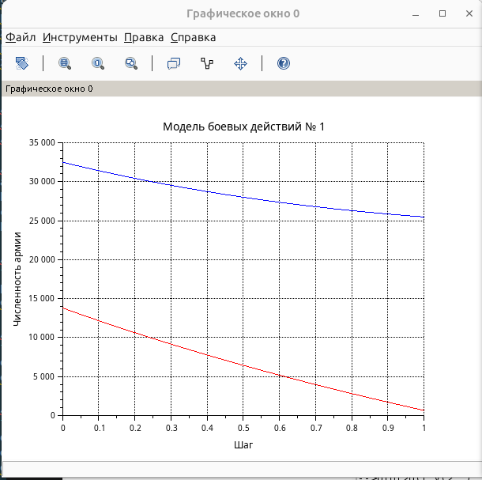
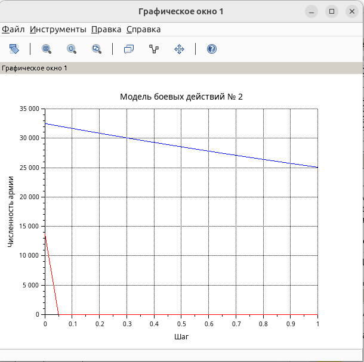

---
## Author
author:
  name: Швецов Михаил Романович
  degrees: Student
  email: 1132236100@rudn.ru
  affiliation:
    - name: Российский университет дружбы народов
      country: Российская Федерация
      postal-code: 117198
      city: Москва
      address: ул. Миклухо-Маклая, д. 6
## Title
title: Лабораторная работа 3
subtitle: Задача моделирования боевых действий
license: CC BY
date: today
date-format: "YYYY-MM-DD" # Example: 2025-09-06
---

# Информация

## Докладчик

:::::::::::::: {.columns align=center}
::: {.column width="70%"}

  * Швецов Михаил Романович
  * студент НКНбд-01-23
  * Российский университет дружбы народов им. П. Лумумбы
  * [1132236100@rudn.ru](mailto:1132236100@rudn.ru)
  * <https://DarkkLord.github.io/ru/>

:::
::: {.column width="30%"}

:::
::::::::::::::

# Вводная часть

## Актуальность

- Решение задачи на моделирование боевых действий. 

::: notes
- Почему именно *структура* презентации важна.
- Время: не более 1 минуты на этот слайд.
:::

## Объект исследования

### Вариант 41

Между страной $X$ и страной $Y$ идет война. Численность состава войск
исчисляется от начала войны и является временными функциями $x(t)$ и $y(t)$.

В начальный момент времени страна $X$ имеет армию численностью
$32500$ человек, а в распоряжении страны $Y$ находится армия
численностью $13800$ человек:

$$
x(0)=32500,
\qquad
y(0)=13800.
$$

Для упрощения модели считаем, что коэффициенты $a$, $b$, $c$, $h$
постоянны. Также считаем $P(t)$ и $Q(t)$ непрерывными функциями.

Необходимо построить графики изменения численности войск армии $X$
и армии $Y$ для следующих случаев.

## Объект исследования

### 1. Модель боевых действий между регулярными войсками

Дана система:

$$
\begin{cases}
\dfrac{dx}{dt}
=
-0,12x(t)-0,54y(t)+|\sin(t+1)|, \\[8pt]
\dfrac{dy}{dt}
=
-0,4x(t)-0,27y(t)+|\cos(t+2)|.
\end{cases}
$$

Начальные условия:

$$
\begin{cases}
x(0)=32500,\\
y(0)=13800.
\end{cases}
$$

## Объект исследования

### 2. Модель ведения боевых действий с участием партизанских отрядов

Дана система:

$$
\begin{cases}
\dfrac{dx}{dt}
=
-0,26x(t)-0,8y(t)+|\sin(2t)|, \\[8pt]
\dfrac{dy}{dt}
=
-0,62x(t)y(t)-0,13y(t)+|\cos(t)|.
\end{cases}
$$

Начальные условия:

$$
\begin{cases}
x(0)=32500,\\
y(0)=13800.
\end{cases}
$$

## Задание

Для обеих моделей необходимо:

1. Построить графики изменения численности армии $X$ и армии $Y$
   во времени.
2. Определить победителя в каждом из рассматриваемых случаев.
3. Найти условие, при котором та или иная сторона выигрывает бой
   для каждого случая.

## Цели и задачи

- Цель:
    - Решить поставленную задачу и предоставить отчет. 
- Задачи:
    - Изучить теоретическую часть.
    - Выполнить задание и скомпелировать ответ в Markdown.

# Непосредственное выполнение

## Постановка задачи

### 1. Модель боевых действий между регулярными войсками

Рассмотрим модель боевых действий между регулярными войсками X и Y.

Для варианта 41 зададим начальную численность первой армии $32500$ человек,
а второй армии $13800$ человек:

$$
x_0 = 32500,
\qquad
y_0 = 13800.
$$

## Постановка задачи

Зададим коэффициент смертности, не связанный с боевыми действиями,
у первой армии $0,12$, у второй $0,27$.

Коэффициенты эффективности первой и второй армии равны $0,4$ и $0,54$
соответственно.

Функция, описывающая подход подкрепления первой армии:

$$
P(t) = |\sin(t+1)|,
$$

подкрепление второй армии описывается функцией:

$$
Q(t) = |\cos(t+2)|.
$$

## Постановка задачи

Тогда получим следующую систему, описывающую противостояние
между регулярными войсками X и Y:

$$
\begin{cases}
\dfrac{dx}{dt}
=
-0,12x(t)-0,54y(t)+|\sin(t+1)|, \\[8pt]
\dfrac{dy}{dt}
=
-0,4x(t)-0,27y(t)+|\cos(t+2)|.
\end{cases}
$$

## Постановка задачи

Зададим начальные условия:

$$
\begin{cases}
x(0)=32500,\\
y(0)=13800.
\end{cases}
$$

## Скриншоты с пояснениями к действиям 

График исходного кода (решения задачи в примере) (рис. -@fig-001).

{#fig-001 width=40%}

## Скриншоты с пояснениями к действиям 

Результаты решения задачи варианта 41  (рис. -@fig-002).

{#fig-002 width=40%}

## Скриншоты с пояснениями к действиям 

Результаты решения задачи варианта 41 (рис. -@fig-003).

{#fig-003 width=40%}

# Заключение

## Главный вывод

- Достигнута поставленная цель;
- Созданы репозитории, рабочаа пространство и выполнено задание из лабораторной работы;

