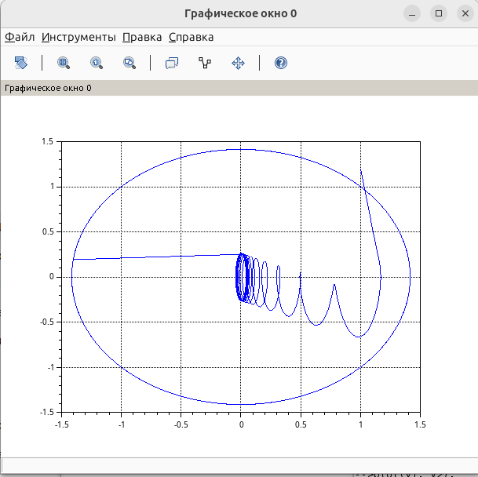

---
## Author
author:
  name: Швецов Михаил Романович
  degrees: Student
  email: 1132236100@rudn.ru
  affiliation:
    - name: Российский университет дружбы народов
      country: Российская Федерация
      postal-code: 117198
      city: Москва
      address: ул. Миклухо-Маклая, д. 6
## Title
title: Лабораторная работа 4
subtitle: Задача моделирования гармонических колебаний
license: CC BY
date: today
date-format: "YYYY-MM-DD" # Example: 2025-09-06
---

# Информация

## Докладчик

:::::::::::::: {.columns align=center}
::: {.column width="70%"}

  * Швецов Михаил Романович
  * студент НКНбд-01-23
  * Российский университет дружбы народов им. П. Лумумбы
  * [1132236100@rudn.ru](mailto:1132236100@rudn.ru)
  * <https://DarkkLord.github.io/ru/>

:::
::: {.column width="30%"}

:::
::::::::::::::

# Вводная часть

## Актуальность

- Решение задачи на моделирование гармонических колебаний. 

::: notes
- Почему именно *структура* презентации важна.
- Время: не более 1 минуты на этот слайд.
:::

## Объект исследования

**Вариант №41**

Построить фазовый портрет гармонического осциллятора и решение уравнения гармонического осциллятора для следующих случаев:

1. Колебания гармонического осциллятора без затухания и без действия внешней силы:

$$
\ddot{x} + 3.5x = 0.
$$

2. Колебания гармонического осциллятора с затуханием и без действия внешней силы:

$$
\ddot{x} + 7\dot{x} + 3x = 0.
$$

3. Колебания гармонического осциллятора с затуханием и под действием внешней силы:

$$
\ddot{x} + 5\dot{x} + 2x = 2\sin(6t).
$$

Расчёты выполнить на интервале

$$
t \in [0;37]
$$

с шагом

$$
h = 0.05.
$$

Начальные условия:

$$
x(0) = 1,\qquad \dot{x}(0) = 1.2.
$$

### Задание

Постройте фазовый портрет гармонического осциллятора и решение уравнения
гармонического осциллятора для следующих случаев.

## Объект и предмет исследования

Решение задачи на моделирование гармонических колебаний, вариант 41. 

## Методы исследования

Основным методом является изучение теоретического материала и наработака практического навыка. 

# Теоретическая часть

Теоретическую часть мы можем изучить в файле задания лабораторной раюоты в соответствующем разделе ТУИС. 

# Выполнение лабораторной работы

## 1. Гармонический осциллятор без затухания и без действия внешней силы

Для первого случая задано уравнение:

$$
\ddot{x} + 3.5x = 0.
$$

Сравнивая его с общей моделью гармонического осциллятора
$$
\ddot{x} + \gamma\dot{x} + \omega_0^2x = f(t),
$$
получаем $\gamma = 0$, $\omega_0 = \sqrt{3.5}$ и $f(t)=0$.

Начальные условия:
$$
x(0)=1,\qquad \dot{x}(0)=1.2.
$$

В результате получаем незатухающие периодические колебания. Фазовый портрет представляет собой замкнутую траекторию, так как энергия системы сохраняется.

Построим численное решение задачи, см Приложение А. 

# Непосредственное выполнение

## Скриншоты с пояснениями к действиям 

График исходного кода (решения задачи в примере) (рис. -@fig-001).

{#fig-001 width=40%}

## Скриншоты с пояснениями к действиям 

Результаты решения задачи варианта 41  (рис. -@fig-002).

{#fig-002 width=40%}

# Заключение

## Главный вывод

- Достигнута поставленная цель;
- Созданы репозитории, рабочаа пространство и выполнено задание из лабораторной работы;

