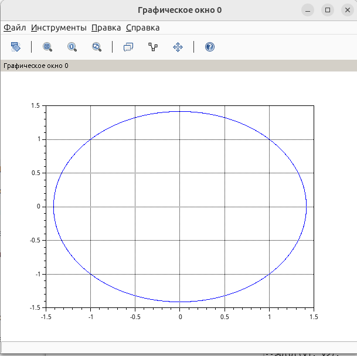

---
## Author
author:
  name: Швецов Михаил Романович
  degrees: Student
  email: 1132236100rudn.ru
  affiliation:
    - name: Российский университет дружбы народов
      country: Российская Федерация
      postal-code: 117198
      city: Москва
      address: ул. Миклухо-Маклая, д. 6

## Title
title: "Отчёт по лабораторной работе 4"
subtitle: "Моделирование гармонических колебаний"
license: "CC BY"
abstract: |
  В данном отчёте представлены результаты выполнения лабораторной работы по теме "Задача моделирования гармонических колебаний"
  Описаны использованные методы, полученные экспериментальные данные и их анализ.

  Сделаны выводы о достижении поставленной цели.
keywords: [лабораторная работа, шаблон, Markdown, Pandoc]
---

# Введение

## Актуальность

В данной работе мы решили задачу моделирования гармонических колебаний по предоставленному примеру решения. 

## Цель работы

Решить представленную зачаду в указанном варианте.

## Задачи

## Условие задачи

**Вариант №41**

Построить фазовый портрет гармонического осциллятора и решение уравнения гармонического осциллятора для следующих случаев:

1. Колебания гармонического осциллятора без затухания и без действия внешней силы:

$$
\ddot{x} + 3.5x = 0.
$$

2. Колебания гармонического осциллятора с затуханием и без действия внешней силы:

$$
\ddot{x} + 7\dot{x} + 3x = 0.
$$

3. Колебания гармонического осциллятора с затуханием и под действием внешней силы:

$$
\ddot{x} + 5\dot{x} + 2x = 2\sin(6t).
$$

Расчёты выполнить на интервале

$$
t \in [0;37]
$$

с шагом

$$
h = 0.05.
$$

Начальные условия:

$$
x(0) = 1,\qquad \dot{x}(0) = 1.2.
$$

### Задание

Постройте фазовый портрет гармонического осциллятора и решение уравнения
гармонического осциллятора для следующих случаев.

## Объект и предмет исследования

Решение задачи на моделирование гармонических колебаний, вариант 41. 

## Методы исследования

Основным методом является изучение теоретического материала и наработака практического навыка. 

# Теоретическая часть

Теоретическую часть мы можем изучить в файле задания лабораторной раюоты в соответствующем разделе ТУИС. 

# Выполнение лабораторной работы

## 1. Гармонический осциллятор без затухания и без действия внешней силы

Для первого случая задано уравнение:

$$
\ddot{x} + 3.5x = 0.
$$

Сравнивая его с общей моделью гармонического осциллятора
$$
\ddot{x} + \gamma\dot{x} + \omega_0^2x = f(t),
$$
получаем $\gamma = 0$, $\omega_0 = \sqrt{3.5}$ и $f(t)=0$.

Начальные условия:
$$
x(0)=1,\qquad \dot{x}(0)=1.2.
$$

В результате получаем незатухающие периодические колебания. Фазовый портрет представляет собой замкнутую траекторию, так как энергия системы сохраняется.

Построим численное решение задачи, см Приложение А. 

# Скриншоты выполнения лабораторной работы

График исходного кода (решения задачи в примере) (рис. -@fig-001).

{#fig-001 width=70%}

Результаты решения задачи варианта 41  (рис. -@fig-002).

{#fig-002 width=70%}

# Заключение

- Достигнута поставленная цель;
- Решена предоставленная задача, а также изчуна теоретическая часть.

# Список литературы {.unnumbered}

::: {#refs}

1. Knuth D.E. Literate Programming // The Computer Journal. Oxford University Press (OUP), 1984. Т. 27, № 2. С. 97–111.
2. Schulte E. и др. A Multi-Language Computing Environment for Literate Programming and Reproducible Research // Journal of Statistical Software. Foundation for Open Access Statistic, 2012. Т. 46, № 3.
3. Kery M.B. и др. The Story in the Notebook // Proceedings of the 2018 CHI Conference on Human Factors in Computing Systems. ACM, 2018. С. 1–11.

:::

\appendix

# Приложения {.appendix}

Приложение А. Листинг кода для решения задачи (SciLab).

```

//Параметры осциллятора
//x'' + g* x' + w^2* x = f(t)
//w - частота
//g - затухание
w = sqrt(2);
g = 5.00;

//Правая часть уравнения f(t)
function f=f(t)
f = -2.*sin(6.*t);
endfunction

///Вектор-функция f(t, x)
///для решения системы дифференциальных уравнений
///x' = y(t, x)
///где x - искомый вектор
function dx=y(t, x)
dx(1) = x(2);
dx(2) = -w.* w.* x(1) - g.* x(2) - f(t);
endfunction

//Точка, в которой заданы
//начальные условия
t0 = 0;

//Вектор начальных условий
//x(t0) = x0
x0 = [1; 1.2];

//Интервал на котором будет
//решаться задача
t = [0: 0.05: 37];

//Решаем дифференциальные уравнения
//с начальным условием x(t0) = x0
//на интервале t
//с правой частью, заданной y
//и записываем решение в матрицу x
x = ode(x0, t0, t, y);

//Количество столбцов в матрице
n = size(x, "c");

//Переписываем отдельно
//x в y1, x' в y2
for i = 1: n
y1(i) = x(1, i);
y2(i) = x(2, i);
end

//Рисуем фазовый портрет: зависимость x(x')
plot(y1, y2);
xgrid();

```
