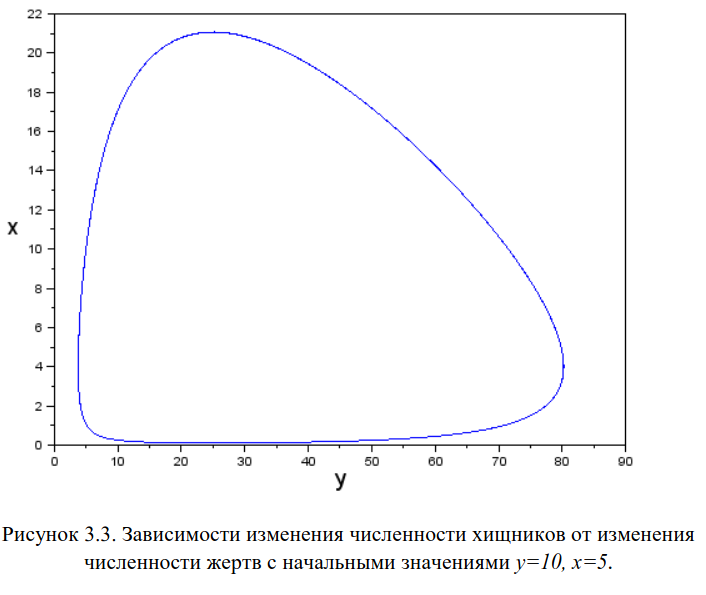

---
## Author
author:
  name: Швецов Михаил Романович
  degrees: Student
  email: 1132236100@rudn.ru
  affiliation:
    - name: Российский университет дружбы народов
      country: Российская Федерация
      postal-code: 117198
      city: Москва
      address: ул. Миклухо-Маклая, д. 6
## Title
title: Лабораторная работа 5
subtitle: Модель хищник-жертва
license: CC BY
date: today
date-format: "YYYY-MM-DD" # Example: 2025-09-06
---

# Информация

## Докладчик

:::::::::::::: {.columns align=center}
::: {.column width="70%"}

  * Швецов Михаил Романович
  * студент НКНбд-01-23
  * Российский университет дружбы народов им. П. Лумумбы
  * [1132236100@rudn.ru](mailto:1132236100@rudn.ru)
  * <https://DarkkLord.github.io/ru/>

:::
::: {.column width="30%"}

:::
::::::::::::::

# Вводная часть

## Актуальность

- Решение задачи на моделирование хищник-жертва. 

::: notes
- Почему именно *структура* презентации важна.
- Время: не более 1 минуты на этот слайд.
:::

## Объект исследования

**Вариант №41**

Для модели «хищник-жертва»:

$$
\begin{cases}
\dfrac{dx}{dt}=-0.58x(t)+0.048x(t)y(t),\\[6pt]
\dfrac{dy}{dt}=0.38y(t)-0.028x(t)y(t).
\end{cases}
$$

Построить график зависимости численности хищников от численности жертв, а также графики изменения численности хищников и численности жертв при следующих начальных условиях:

$$
x_0=7,\qquad y_0=15.
$$

## Объект и предмет исследования

Решение задачи на моделирование системы хищник-жертва, вариант 41. 

## Методы исследования

Основным методом является изучение теоретического материала и наработака практического навыка. 

# Теоретическая часть

Теоретическую часть мы можем изучить в файле задания лабораторной раюоты в соответствующем разделе ТУИС. 

# Выполнение лабораторной работы

Для варианта №41 задана модель «хищник-жертва»:

$$
\begin{cases}
\dfrac{dx}{dt}=-0.58x(t)+0.048x(t)y(t),\\[6pt]
\dfrac{dy}{dt}=0.38y(t)-0.028x(t)y(t).
\end{cases}
$$

Здесь $x$ — численность хищников, а $y$ — численность жертв.

## Выполнение лабораторной работы

Начальные условия:

$$
x(0)=7,\qquad y(0)=15.
$$

В соответствии с предложенным примером модели Лотки–Вольтерры зададим коэффициенты:

$$
a=0.58,\qquad b=0.38,\qquad c=0.048,\qquad d=0.028.
$$

## Выполнение лабораторной работы

Численное решение системы выполняется с помощью функции `ode` на интервале

$$
t\in[0;400]
$$

с шагом $0.1$.

## Выполнение лабораторной работы

### Стационарное состояние

Стационарное состояние определяется из условий:

$$
\frac{dx}{dt}=0,\qquad \frac{dy}{dt}=0.
$$

Для ненулевых значений численности получаем:

$$
-0.58+0.048y=0,
$$

откуда

$$
y^*=\frac{0.58}{0.048}\approx12.08.
$$

Из второго уравнения:

$$
0.38-0.028x=0,
$$

следовательно,

$$
x^*=\frac{0.38}{0.028}\approx13.57.
$$

## Выполнение лабораторной работы

Таким образом, стационарное состояние системы:

$$
\boxed{x^*\approx13.57,\qquad y^*\approx12.08}.
$$

## Выполнение лабораторной работы

Начальное состояние $(7;15)$ не совпадает со стационарным. Поэтому численность хищников и жертв изменяется во времени. При увеличении количества жертв создаются условия для роста численности хищников. Увеличение количества хищников, в свою очередь, приводит к уменьшению числа жертв. После уменьшения количества жертв численность хищников также начинает снижаться, вследствие чего популяция жертв снова увеличивается.

Таким образом, в системе возникают периодические изменения численности обеих популяций. На фазовом портрете формируется замкнутая траектория вокруг стационарного состояния.

Построим численное решение задачи, см Приложение А. 

# Непосредственное выполнение

## Скриншоты с пояснениями к действиям 

График исходного кода (решения задачи в примере) (рис. -@fig-001).

{#fig-001 width=40%}

## Скриншоты с пояснениями к действиям 

Результаты решения задачи варианта 41  (рис. -@fig-002).

{#fig-002 width=40%}

# Заключение

## Главный вывод

В ходе работы была исследована модель взаимодействия хищников и жертв для варианта №41. С помощью функции `ode` было получено численное решение системы и построен фазовый портрет зависимости численности хищников от численности жертв.

Стационарное состояние системы находится в точке:

$$
\boxed{(x^*;y^*)=(13.57;12.08)}.
$$

При заданных начальных условиях система совершает периодические колебания численности хищников и жертв вокруг стационарного состояния.

