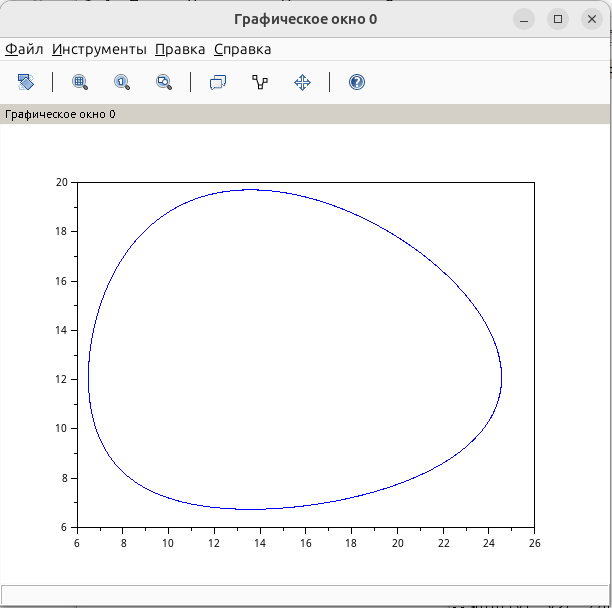

---
## Author
author:
  name: Швецов Михаил Романович
  degrees: Student
  email: 1132236100rudn.ru
  affiliation:
    - name: Российский университет дружбы народов
      country: Российская Федерация
      postal-code: 117198
      city: Москва
      address: ул. Миклухо-Маклая, д. 6

## Title
title: "Отчёт по лабораторной работе 5"
subtitle: "Модель хищник-жертва"
license: "CC BY"
abstract: |
  В данном отчёте представлены результаты выполнения лабораторной работы по теме "Модель хищник-жертва"
  Описаны использованные методы, полученные экспериментальные данные и их анализ.

  Сделаны выводы о достижении поставленной цели.
keywords: [лабораторная работа, шаблон, Markdown, Pandoc]
---

# Введение

## Актуальность

В данной работе мы решили задачу "Модель хищник-жертва" по предоставленному примеру решения. 

## Цель работы

Решить представленную зачаду в указанном варианте.

## Задачи

## Условие задачи

## Условие

**Вариант №41**

Для модели «хищник-жертва»:

$$
\begin{cases}
\dfrac{dx}{dt}=-0.58x(t)+0.048x(t)y(t),\\[6pt]
\dfrac{dy}{dt}=0.38y(t)-0.028x(t)y(t).
\end{cases}
$$

Построить график зависимости численности хищников от численности жертв, а также графики изменения численности хищников и численности жертв при следующих начальных условиях:

$$
x_0=7,\qquad y_0=15.
$$

Найти стационарное состояние системы.

## Объект и предмет исследования

Решение задачи на моделирование хищник-жертва, вариант 41. 

## Методы исследования

Основным методом является изучение теоретического материала и наработака практического навыка. 

# Теоретическая часть

Теоретическую часть мы можем изучить в файле задания лабораторной раюоты в соответствующем разделе ТУИС. 

# Выполнение лабораторной работы

## Пояснение

Для варианта №41 задана модель «хищник-жертва»:

$$
\begin{cases}
\dfrac{dx}{dt}=-0.58x(t)+0.048x(t)y(t),\\[6pt]
\dfrac{dy}{dt}=0.38y(t)-0.028x(t)y(t).
\end{cases}
$$

Здесь $x$ — численность хищников, а $y$ — численность жертв.

Начальные условия:

$$
x(0)=7,\qquad y(0)=15.
$$

В соответствии с предложенным примером модели Лотки–Вольтерры зададим коэффициенты:

$$
a=0.58,\qquad b=0.38,\qquad c=0.048,\qquad d=0.028.
$$

Численное решение системы выполняется с помощью функции `ode` на интервале

$$
t\in[0;400]
$$

с шагом $0.1$.

### Стационарное состояние

Стационарное состояние определяется из условий:

$$
\frac{dx}{dt}=0,\qquad \frac{dy}{dt}=0.
$$

Для ненулевых значений численности получаем:

$$
-0.58+0.048y=0,
$$

откуда

$$
y^*=\frac{0.58}{0.048}\approx12.08.
$$

Из второго уравнения:

$$
0.38-0.028x=0,
$$

следовательно,

$$
x^*=\frac{0.38}{0.028}\approx13.57.
$$

Таким образом, стационарное состояние системы:

$$
\boxed{x^*\approx13.57,\qquad y^*\approx12.08}.
$$

Начальное состояние $(7;15)$ не совпадает со стационарным. Поэтому численность хищников и жертв изменяется во времени. При увеличении количества жертв создаются условия для роста численности хищников. Увеличение количества хищников, в свою очередь, приводит к уменьшению числа жертв. После уменьшения количества жертв численность хищников также начинает снижаться, вследствие чего популяция жертв снова увеличивается.

Таким образом, в системе возникают периодические изменения численности обеих популяций. На фазовом портрете формируется замкнутая траектория вокруг стационарного состояния.

### Вывод

В ходе работы была исследована модель взаимодействия хищников и жертв для варианта №41. С помощью функции `ode` было получено численное решение системы и построен фазовый портрет зависимости численности хищников от численности жертв.

Стационарное состояние системы находится в точке:

$$
\boxed{(x^*;y^*)=(13.57;12.08)}.
$$

При заданных начальных условиях система совершает периодические колебания численности хищников и жертв вокруг стационарного состояния.

Построим численное решение задачи, см Приложение А. 

# Скриншоты выполнения лабораторной работы

График исходного кода (решения задачи в примере) (рис. -@fig-001).

{#fig-001 width=70%}

Результаты решения задачи варианта 41  (рис. -@fig-002).

{#fig-002 width=70%}

# Заключение

- Достигнута поставленная цель;
- Решена предоставленная задача, а также изчуна теоретическая часть.

# Список литературы {.unnumbered}

::: {#refs}

1. Knuth D.E. Literate Programming // The Computer Journal. Oxford University Press (OUP), 1984. Т. 27, № 2. С. 97–111.
2. Schulte E. и др. A Multi-Language Computing Environment for Literate Programming and Reproducible Research // Journal of Statistical Software. Foundation for Open Access Statistic, 2012. Т. 46, № 3.
3. Kery M.B. и др. The Story in the Notebook // Proceedings of the 2018 CHI Conference on Human Factors in Computing Systems. ACM, 2018. С. 1–11.

:::

\appendix

# Приложения {.appendix}

Приложение А. Листинг кода для решения задачи (SciLab).

```

a= 0.58; // коэффициент естественной смертности хищников
b= 0.38; // коэффициент естественного прироста жертв
c= 0.048; // коэффициент увеличения числа хищников
d= 0.028; // коэффициент смертности жертв

function dx=syst2(t, x)
dx(1) = -a*x(1) + c*x(1)*x(2);
dx(2) = b*x(2) - d*x(1)*x(2);
endfunction

t0 = 0;

x0=[7;15]; //начальное значение x и у (популяция хищников и популяция жертв)

t = [0: 0.1: 400];

y = ode(x0, t0, t, syst2);

n = size(y, "c");

for i = 1: n
y2(i) = y(2, i);
y1(i) = y(1, i);
end

//plot(t, y1); //построение графика колебаний изменения числа
//популяции хищников

//plot(t, y2); //построение графика колебаний изменения числа
//популяции жертв

plot(y1, y2); //построение графика зависимости изменения
//численности хищников от изменения численности жертв

```
