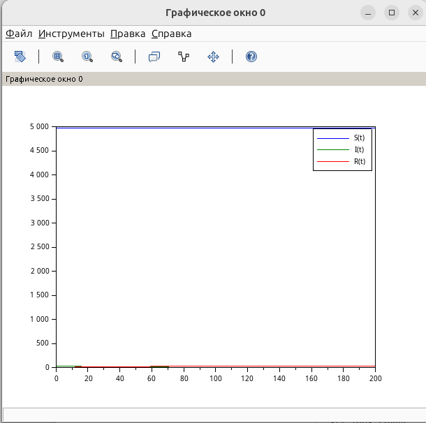

---
## Author
author:
  name: Швецов Михаил Романович
  degrees: Student
  email: 1132236100@rudn.ru
  affiliation:
    - name: Российский университет дружбы народов
      country: Российская Федерация
      postal-code: 117198
      city: Москва
      address: ул. Миклухо-Маклая, д. 6
## Title
title: Лабораторная работа 6
subtitle: Задача об эпидемии
license: CC BY
date: today
date-format: "YYYY-MM-DD" # Example: 2025-09-06
---

# Информация

## Докладчик

:::::::::::::: {.columns align=center}
::: {.column width="70%"}

  * Швецов Михаил Романович
  * студент НКНбд-01-23
  * Российский университет дружбы народов им. П. Лумумбы
  * [1132236100@rudn.ru](mailto:1132236100@rudn.ru)
  * <https://DarkkLord.github.io/ru/>

:::
::: {.column width="30%"}

:::
::::::::::::::

# Вводная часть

## Актуальность

- Решение Задачb об эпидемии. 

::: notes
- Почему именно *структура* презентации важна.
- Время: не более 1 минуты на этот слайд.
:::

## Объект исследования

Для варианта 41:

$$
S(0)=5000-30-1=4969.
$$

Необходимо построить графики изменения числа особей в каждой из трёх
групп: $S(t)$, $I(t)$ и $R(t)$.

Необходимо рассмотреть, как будет протекать эпидемия в двух случаях:

1. если $I(0)\leq I^*$;

2. если $I(0)>I^*$.

## Объект и предмет исследования

Решение задачи об эпидемии, вариант 41. 

## Методы исследования

Основным методом является изучение теоретического материала и наработака практического навыка. 

# Теоретическая часть

Теоретическую часть мы можем изучить в файле задания лабораторной раюоты в соответствующем разделе ТУИС. 

# Выполнение лабораторной работы

## Выполнение лабораторной работы

Начальные условия:

$$
x(0)=7,\qquad y(0)=15.
$$

В соответствии с предложенным примером модели Лотки–Вольтерры зададим коэффициенты:

$$
a=0.58,\qquad b=0.38,\qquad c=0.048,\qquad d=0.028.
$$

## Выполнение лабораторной работы

Численное решение системы выполняется с помощью функции `ode` на интервале

$$
t\in[0;400]
$$

с шагом $0.1$.

## Выполнение лабораторной работы

В данной математической модели население разделяется на три группы:

- $S(t)$ — число восприимчивых к болезни, но пока здоровых людей;
- $I(t)$ — число инфицированных людей, являющихся распространителями инфекции;
- $R(t)$ — число здоровых людей, имеющих иммунитет к болезни.

В начальный момент времени для варианта 41 заданы значения

$$
N=5000,\qquad I(0)=30,\qquad R(0)=1.
$$

Поэтому начальное количество восприимчивых к болезни людей составляет

$$
S(0)=N-I(0)-R(0)=5000-30-1=4969.
$$

Согласно модели, характер развития эпидемии определяется сравнением
числа инфицированных $I(t)$ с критическим значением $I^*$.

## Выполнение лабораторной работы

### Случай 1: $I(0)\leq I^*$

Если число инфицированных не превышает критического значения,
то больные считаются изолированными и не заражают восприимчивых людей.

В этом случае система уравнений имеет вид

$$
\frac{dS}{dt}=0,
$$

$$
\frac{dI}{dt}=-\beta I,
$$

$$
\frac{dR}{dt}=\beta I.
$$

Следовательно, количество восприимчивых людей $S(t)$ не изменяется.
Количество инфицированных $I(t)$ постепенно уменьшается вследствие
выздоровления, а количество людей с иммунитетом $R(t)$ увеличивается.

Для рассмотрения данного случая примем

$$
I^*=50.
$$

Так как

$$
I(0)=30\leq50,
$$

начальное количество инфицированных не превышает критического значения.
Поэтому распространения инфекции среди восприимчивых людей не происходит.

## Выполнение лабораторной работы

### Случай 2: $I(0)>I^*$

Если количество инфицированных превышает критическое значение,
то они начинают заражать восприимчивых людей.

В этом случае система уравнений имеет вид

$$
\frac{dS}{dt}=-\alpha SI,
$$

$$
\frac{dI}{dt}=\alpha SI-\beta I,
$$

$$
\frac{dR}{dt}=\beta I.
$$

## Выполнение лабораторной работы

Для рассмотрения второго случая примем

$$
I^*=20.
$$

Тогда

$$
I(0)=30>20.
$$

Следовательно, инфекция начинает распространяться среди восприимчивых
людей. Количество восприимчивых $S(t)$ уменьшается, количество
инфицированных $I(t)$ вначале увеличивается, а количество людей
с иммунитетом $R(t)$ постепенно возрастает.

## Выполнение лабораторной работы

В расчётах используются коэффициенты

$$
\alpha=0.01,\qquad \beta=0.02,
$$

где $\alpha$ — коэффициент заболеваемости, а $\beta$ —
коэффициент выздоровления.

Построим численное решение задачи, см Приложение А, В. 

# Непосредственное выполнение

## Скриншоты с пояснениями к действиям 

График для случая I(0)<=I* (рис. -@fig-001).

{#fig-001 width=40%}

## Скриншоты с пояснениями к действиям 

График для случая I(0)>I* (рис. -@fig-002).

{#fig-002 width=40%}

# Заключение

## Главный вывод

В ходе лабораторной работы была рассмотрена математическая модель распространения эпидемии для варианта 41. Население острова составляет $5000$ человек. В начальный момент времени число инфицированных составляет $30$ человек, число людей с иммунитетом — $1$ человек, а число восприимчивых к заболеванию — $4969$ человек.

Были рассмотрены два случая развития эпидемии в зависимости от соотношения начального числа инфицированных $I(0)$ и критического значения $I^*$.

В первом случае при $I(0)\leq I^*$ распространения инфекции среди восприимчивых людей не происходит. Число восприимчивых остаётся постоянным, число инфицированных постепенно уменьшается, а число людей с иммунитетом увеличивается.

Во втором случае при $I(0)>I^*$ начинается распространение инфекции. Число восприимчивых людей уменьшается, число инфицированных сначала увеличивается, а затем начинает снижаться, при этом число людей с иммунитетом постепенно возрастает.

Таким образом, модель позволяет проследить изменение численности трёх групп населения и показать зависимость характера эпидемии от критического числа инфицированных $I^*$.
