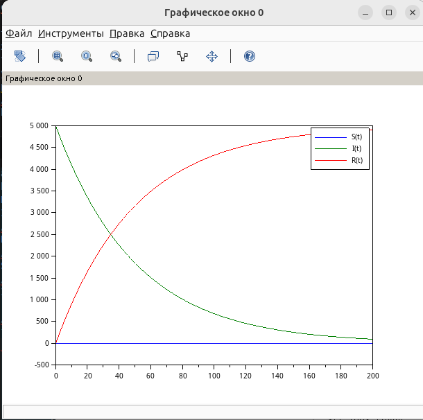

---
## Author
author:
  name: Швецов Михаил Романович
  degrees: Student
  email: 1132236100rudn.ru
  affiliation:
    - name: Российский университет дружбы народов
      country: Российская Федерация
      postal-code: 117198
      city: Москва
      address: ул. Миклухо-Маклая, д. 6

## Title
title: "Отчёт по лабораторной работе 6"
subtitle: "Задача об эпидемии"
license: "CC BY"
abstract: |
  В данном отчёте представлены результаты выполнения лабораторной работы по теме "Задача об эпидемии"
  Описаны использованные методы, полученные экспериментальные данные и их анализ.

  Сделаны выводы о достижении поставленной цели.
keywords: [лабораторная работа, шаблон, Markdown, Pandoc]
---

# Введение

## Актуальность

В данной работе мы решили задачу "Задача об эпидемии" по предоставленному примеру решения. 

## Цель работы

Решить представленную зачаду в указанном варианте.

## Задачи

На одном острове вспыхнула эпидемия. Известно, что из всех проживающих
на острове $N=5000$ человек в момент начала эпидемии ($t=0$)
число заболевших людей, являющихся распространителями инфекции,

$$
I(0)=30.
$$

Число здоровых людей с иммунитетом к болезни в начальный момент времени:

$$
R(0)=1.
$$

Таким образом, число людей, восприимчивых к болезни, но пока здоровых,
в начальный момент времени определяется по формуле

$$
S(0)=N-I(0)-R(0).
$$

## Задачи

Для варианта 41:

$$
S(0)=5000-30-1=4969.
$$

Необходимо построить графики изменения числа особей в каждой из трёх
групп: $S(t)$, $I(t)$ и $R(t)$.

Необходимо рассмотреть, как будет протекать эпидемия в двух случаях:

1. если $I(0)\leq I^*$;

2. если $I(0)>I^*$.

## Объект и предмет исследования

Решение задачи об эпидемии, вариант 41. 

## Методы исследования

Основным методом является изучение теоретического материала и наработака практического навыка. 

# Теоретическая часть

Теоретическую часть мы можем изучить в файле задания лабораторной раюоты в соответствующем разделе ТУИС. 

# Выполнение лабораторной работы

## Пояснение

В данной математической модели население разделяется на три группы:

- $S(t)$ — число восприимчивых к болезни, но пока здоровых людей;
- $I(t)$ — число инфицированных людей, являющихся распространителями инфекции;
- $R(t)$ — число здоровых людей, имеющих иммунитет к болезни.

В начальный момент времени для варианта 41 заданы значения

$$
N=5000,\qquad I(0)=30,\qquad R(0)=1.
$$

Поэтому начальное количество восприимчивых к болезни людей составляет

$$
S(0)=N-I(0)-R(0)=5000-30-1=4969.
$$

Согласно модели, характер развития эпидемии определяется сравнением
числа инфицированных $I(t)$ с критическим значением $I^*$.

### Случай 1: $I(0)\leq I^*$

Если число инфицированных не превышает критического значения,
то больные считаются изолированными и не заражают восприимчивых людей.

В этом случае система уравнений имеет вид

$$
\frac{dS}{dt}=0,
$$

$$
\frac{dI}{dt}=-\beta I,
$$

$$
\frac{dR}{dt}=\beta I.
$$

Следовательно, количество восприимчивых людей $S(t)$ не изменяется.
Количество инфицированных $I(t)$ постепенно уменьшается вследствие
выздоровления, а количество людей с иммунитетом $R(t)$ увеличивается.

Для рассмотрения данного случая примем

$$
I^*=50.
$$

Так как

$$
I(0)=30\leq50,
$$

начальное количество инфицированных не превышает критического значения.
Поэтому распространения инфекции среди восприимчивых людей не происходит.

### Случай 2: $I(0)>I^*$

Если количество инфицированных превышает критическое значение,
то они начинают заражать восприимчивых людей.

В этом случае система уравнений имеет вид

$$
\frac{dS}{dt}=-\alpha SI,
$$

$$
\frac{dI}{dt}=\alpha SI-\beta I,
$$

$$
\frac{dR}{dt}=\beta I.
$$

Для рассмотрения второго случая примем

$$
I^*=20.
$$

Тогда

$$
I(0)=30>20.
$$

Следовательно, инфекция начинает распространяться среди восприимчивых
людей. Количество восприимчивых $S(t)$ уменьшается, количество
инфицированных $I(t)$ вначале увеличивается, а количество людей
с иммунитетом $R(t)$ постепенно возрастает.

В расчётах используются коэффициенты

$$
\alpha=0.01,\qquad \beta=0.02,
$$

где $\alpha$ — коэффициент заболеваемости, а $\beta$ —
коэффициент выздоровления.

## Вывод

В ходе лабораторной работы была рассмотрена математическая модель распространения эпидемии для варианта 41. Население острова составляет $5000$ человек. В начальный момент времени число инфицированных составляет $30$ человек, число людей с иммунитетом — $1$ человек, а число восприимчивых к заболеванию — $4969$ человек.

Были рассмотрены два случая развития эпидемии в зависимости от соотношения начального числа инфицированных $I(0)$ и критического значения $I^*$.

В первом случае при $I(0)\leq I^*$ распространения инфекции среди восприимчивых людей не происходит. Число восприимчивых остаётся постоянным, число инфицированных постепенно уменьшается, а число людей с иммунитетом увеличивается.

Во втором случае при $I(0)>I^*$ начинается распространение инфекции. Число восприимчивых людей уменьшается, число инфицированных сначала увеличивается, а затем начинает снижаться, при этом число людей с иммунитетом постепенно возрастает.

Таким образом, модель позволяет проследить изменение численности трёх групп населения и показать зависимость характера эпидемии от критического числа инфицированных $I^*$.

Построим численное решение задачи, см Приложение А. 

# Скриншоты выполнения лабораторной работы

График для случая I(0)<=I* (рис. -@fig-001).

{#fig-001 width=70%}

График для случая I(0)>I* (рис. -@fig-002).

{#fig-002 width=70%}

# Заключение

- Достигнута поставленная цель;
- Решена предоставленная задача, а также изчуна теоретическая часть.

# Список литературы {.unnumbered}

::: {#refs}

1. Knuth D.E. Literate Programming // The Computer Journal. Oxford University Press (OUP), 1984. Т. 27, № 2. С. 97–111.
2. Schulte E. и др. A Multi-Language Computing Environment for Literate Programming and Reproducible Research // Journal of Statistical Software. Foundation for Open Access Statistic, 2012. Т. 46, № 3.
3. Kery M.B. и др. The Story in the Notebook // Proceedings of the 2018 CHI Conference on Human Factors in Computing Systems. ACM, 2018. С. 1–11.

:::

\appendix

# Приложения {.appendix}

Приложение А. Листинг кода для решения задачи (SciLab).

```

a = 0.01;// коэффициент заболеваемости 
b = 0.02;// коэффициент выздоровления
N = 5000;// общая численность популяции
I0 = 30; // количество инфицированных особей в начальный момент 
// времени
R0 = 1; // количество здоровых особей с иммунитетом в начальный 
// момент времени
S0 = N - I0 - R0; // количество восприимчивых к болезни особей в 
// начальный момент времени
Istar = 50; // критическое число инфицированных

// случай, когда I(0)<=I*
function dx=syst(t, x)
    if x(2) > Istar then
        dx(1) = -a*x(1)*x(2);
        dx(2) = a*x(1)*x(2) - b*x(2);
        dx(3) = b*x(2);
    else
        dx(1) = 0;
        dx(2) = -b*x(2);
        dx(3) = b*x(2);
    end
endfunction

t0 = 0;
x0=[S0;I0;R0]; //начальные значения 
t = [0: 0.01: 200];
y = ode(x0, t0, t, syst);
plot(t, y); //построение динамики изменения числа особей в каждой из 
// трех групп 
hl=legend(['S(t)';'I(t)';'R(t)']);

```

Приложение В. Листинг кода для решения задачи (SciLab).

```

a = 0.01;// коэффициент заболеваемости 
b = 0.02;// коэффициент выздоровления
N = 5000;// общая численность популяции
I0 = 30; // количество инфицированных особей в начальный момент 
// времени
R0 = 1; // количество здоровых особей с иммунитетом в начальный 
// момент времени
S0 = N - I0 - R0; // количество восприимчивых к болезни особей в 
// начальный момент времени
Istar = 20; // критическое число инфицированных

// случай, когда I(0)>I*
function dx=syst(t, x)
    if x(2) > Istar then
        dx(1) = -a*x(1)*x(2);
        dx(2) = a*x(1)*x(2) - b*x(2);
        dx(3) = b*x(2);
    else
        dx(1) = 0;
        dx(2) = -b*x(2);
        dx(3) = b*x(2);
    end
endfunction

t0 = 0;
x0=[S0;I0;R0]; //начальные значения 
t = [0: 0.01: 200];
y = ode(x0, t0, t, syst);
plot(t, y); //построение динамики изменения числа особей в каждой из 
// трех групп 
hl=legend(['S(t)';'I(t)';'R(t)']);

```