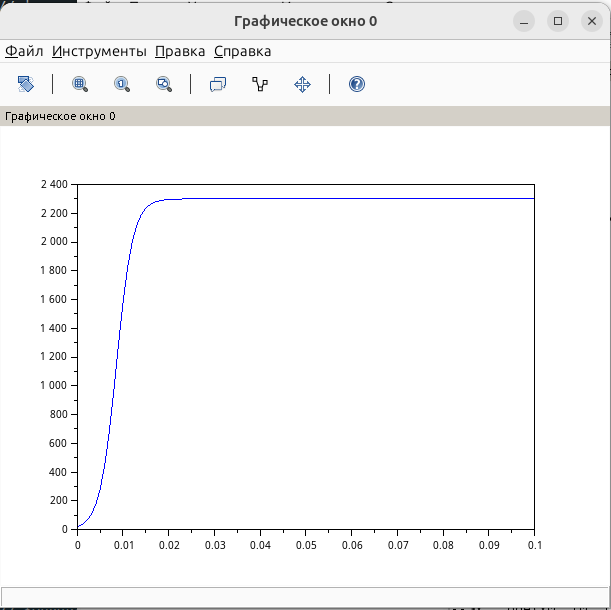

---
## Author
author:
  name: Швецов Михаил Романович
  degrees: Student
  email: 1132236100@rudn.ru
  affiliation:
    - name: Российский университет дружбы народов
      country: Российская Федерация
      postal-code: 117198
      city: Москва
      address: ул. Миклухо-Маклая, д. 6
## Title
title: Лабораторная работа 7
subtitle: Эффективность рекламы
license: CC BY
date: today
date-format: "YYYY-MM-DD" # Example: 2025-09-06
---

# Информация

## Докладчик

:::::::::::::: {.columns align=center}
::: {.column width="70%"}

  * Швецов Михаил Романович
  * студент НКНбд-01-23
  * Российский университет дружбы народов им. П. Лумумбы
  * [1132236100@rudn.ru](mailto:1132236100@rudn.ru)
  * <https://DarkkLord.github.io/ru/>

:::
::: {.column width="30%"}

:::
::::::::::::::

# Вводная часть

## Актуальность

- Решение задачи на эффективность рекламы. 

::: notes
- Почему именно *структура* презентации важна.
- Время: не более 1 минуты на этот слайд.
:::

## Объект исследования

Постройте график распространения рекламы, математическая модель которой
описывается следующими уравнениями:

1. $$\frac{dn}{dt}=(0.205+0.000023n(t))(N-n(t))$$

2. $$\frac{dn}{dt}=(0.0000305+0.24n(t))(N-n(t))$$

3. $$\frac{dn}{dt}=(0.05\sin(t)+0.03\cos(4t)n(t))(N-n(t))$$

При этом объём аудитории

$$N=2300,$$

а в начальный момент времени о товаре знает

$$n(0)=20.$$

Для случая 2 определить, в какой момент времени скорость распространения
рекламы будет иметь максимальное значение.

## Объект и предмет исследования

Решение задачи об эпидемии, вариант 41. 

## Методы исследования

Основным методом является изучение теоретического материала и наработака практического навыка. 

# Теоретическая часть

Теоретическую часть мы можем изучить в файле задания лабораторной раюоты в соответствующем разделе ТУИС. 

# Выполнение лабораторной работы

## Выполнение лабораторной работы

В данной работе рассматривается математическая модель распространения
рекламы. В модели $n(t)$ — количество потенциальных покупателей,
которые знают о товаре в момент времени $t$, а $N$ — общее количество
потенциальных покупателей.

Для варианта 41 задано:

$$
N=2300,
$$

$$
n(0)=20.
$$

## Выполнение лабораторной работы

Модель распространения рекламы имеет общий вид

$$
\frac{dn}{dt}=
\left(\alpha_1(t)+\alpha_2(t)n(t)\right)(N-n(t)).
$$

Первое слагаемое $\alpha_1(t)$ описывает влияние платной рекламы,
а второе слагаемое $\alpha_2(t)n(t)$ — распространение информации
между людьми, то есть эффект «сарафанного радио».

### Первое уравнение

Для первого случая:

$$
\frac{dn}{dt}
=
(0.205+0.000023n(t))(2300-n(t)).
$$

В этом случае коэффициенты распространения рекламы постоянны.
С увеличением числа людей, знающих о товаре, скорость распространения
информации сначала увеличивается. Затем, когда количество
информированных людей приближается к $N=2300$, число ещё
не знающих о товаре людей уменьшается, поэтому скорость распространения
рекламы снижается.

## Выполнение лабораторной работы

### Второе уравнение

Для второго случая:

$$
\frac{dn}{dt}
=
(0.0000305+0.24n(t))(2300-n(t)).
$$

Здесь коэффициент сарафанного радио значительно больше, чем в первом
случае. Поэтому распространение информации происходит значительно
быстрее.

## Выполнение лабораторной работы

Максимальная скорость распространения определяется максимумом функции

$$
v(n)=(0.0000305+0.24n)(2300-n).
$$

Найдём положение максимума:

$$
v'(n)=0.24(2300-n)-(0.0000305+0.24n).
$$

Отсюда

$$
0.24\cdot2300-0.0000305-0.48n=0,
$$

поэтому

$$
n_{\max}
=
\frac{0.24\cdot2300-0.0000305}{2\cdot0.24}
\approx1149.99994.
$$

## Выполнение лабораторной работы

Таким образом, максимальная скорость распространения рекламы
наблюдается практически в момент, когда о товаре знает половина
аудитории:

$$
n_{\max}\approx1150.
$$

При начальном условии $n(0)=20$ это значение достигается примерно
при

$$
t\approx0.00858.
$$

## Выполнение лабораторной работы

Следовательно, для второго случая максимальная скорость распространения
рекламы достигается примерно через $0.0086$ единицы времени от начала
рекламной кампании.

### Третье уравнение

В третьем случае коэффициенты зависят от времени:

$$
\frac{dn}{dt}
=
(0.05\sin(t)+0.03\cos(4t)n(t))(2300-n(t)).
$$

## Выполнение лабораторной работы

Поэтому интенсивность платной рекламы и влияние «сарафанного радио»
периодически изменяются во времени.

Полученный график позволяет увидеть, как изменение интенсивности
рекламного воздействия влияет на скорость распространения информации
среди потенциальных покупателей.

Построим численное решение задачи, см Приложение А, В, С. 

# Непосредственное выполнение

## Скриншоты с пояснениями к действиям 

График для случая уравнения 1  (рис. -@fig-001).

{#fig-001 width=40%}

## Скриншоты с пояснениями к действиям 

График для уравнения 2 (рис. -@fig-002).

{#fig-002 width=40%}

## Скриншоты с пояснениями к действиям 

График для уравнения 3 (рис. -@fig-003).

{#fig-003 width=40%}

# Заключение

## Главный вывод
В ходе лабораторной работы была рассмотрена математическая модель распространения рекламы для варианта №41. Были построены графики изменения количества людей, знающих о товаре, для трёх заданных моделей распространения рекламы.

В первой модели учитываются постоянные воздействия платной рекламы и «сарафанного радио». Во второй модели влияние «сарафанного радио» значительно сильнее, поэтому распространение информации происходит быстрее. Для второго случая также был определён момент максимальной скорости распространения рекламы.

В третьей модели коэффициенты распространения рекламы зависят от времени, поэтому скорость распространения информации изменяется в течение рекламной кампании.

Таким образом, с помощью математической модели можно исследовать эффективность рекламной кампании и определить, как изменение коэффициентов платной рекламы и «сарафанного радио» влияет на скорость распространения информации среди потенциальных покупателей.
