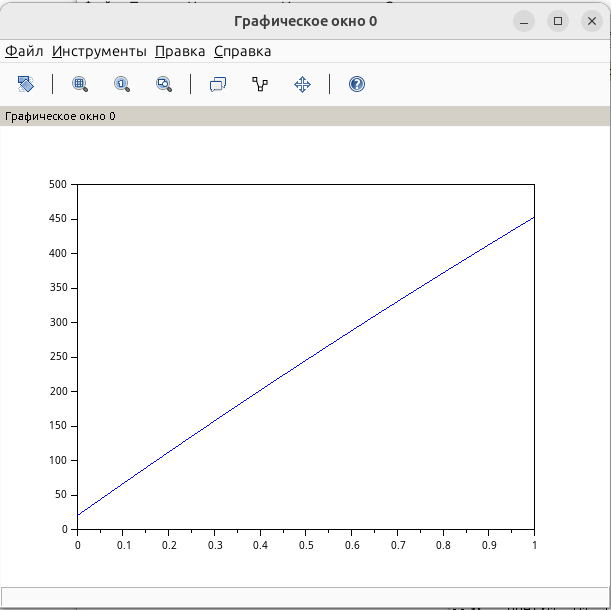
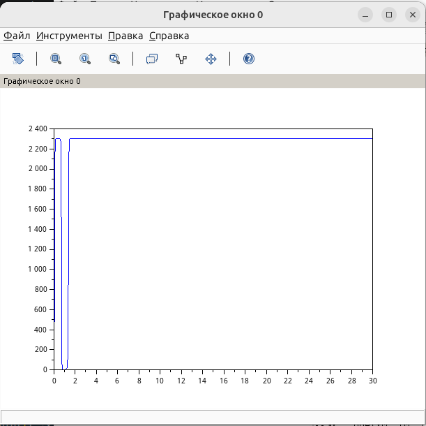

---
## Author
author:
  name: Швецов Михаил Романович
  degrees: Student
  email: 1132236100rudn.ru
  affiliation:
    - name: Российский университет дружбы народов
      country: Российская Федерация
      postal-code: 117198
      city: Москва
      address: ул. Миклухо-Маклая, д. 6

## Title
title: "Отчёт по лабораторной работе 7"
subtitle: "Эффективность рекламы"
license: "CC BY"
abstract: |
  В данном отчёте представлены результаты выполнения лабораторной работы по теме "Эффективность рекламы"
  Описаны использованные методы, полученные экспериментальные данные и их анализ.

  Сделаны выводы о достижении поставленной цели.
keywords: [лабораторная работа, шаблон, Markdown, Pandoc]
---

# Введение

## Актуальность

В данной работе мы решили задачу "Эффективность рекламы" по предоставленному примеру решения. 

## Цель работы

Решить представленную зачаду в указанном варианте.

## Задачи

Постройте график распространения рекламы, математическая модель которой
описывается следующими уравнениями:

1. $$\frac{dn}{dt}=(0.205+0.000023n(t))(N-n(t))$$

2. $$\frac{dn}{dt}=(0.0000305+0.24n(t))(N-n(t))$$

3. $$\frac{dn}{dt}=(0.05\sin(t)+0.03\cos(4t)n(t))(N-n(t))$$

При этом объём аудитории

$$N=2300,$$

а в начальный момент времени о товаре знает

$$n(0)=20.$$

Для случая 2 определить, в какой момент времени скорость распространения
рекламы будет иметь максимальное значение.

## Объект и предмет исследования

Решение задачи, вариант 41. 

## Методы исследования

Основным методом является изучение теоретического материала и наработака практического навыка. 

# Теоретическая часть

Теоретическую часть мы можем изучить в файле задания лабораторной раюоты в соответствующем разделе ТУИС. 

# Выполнение лабораторной работы

## Пояснение

В данной работе рассматривается математическая модель распространения
рекламы. В модели $n(t)$ — количество потенциальных покупателей,
которые знают о товаре в момент времени $t$, а $N$ — общее количество
потенциальных покупателей.

Для варианта 41 задано:

$$
N=2300,
$$

$$
n(0)=20.
$$

Модель распространения рекламы имеет общий вид

$$
\frac{dn}{dt}=
\left(\alpha_1(t)+\alpha_2(t)n(t)\right)(N-n(t)).
$$

Первое слагаемое $\alpha_1(t)$ описывает влияние платной рекламы,
а второе слагаемое $\alpha_2(t)n(t)$ — распространение информации
между людьми, то есть эффект «сарафанного радио».

### Первое уравнение

Для первого случая:

$$
\frac{dn}{dt}
=
(0.205+0.000023n(t))(2300-n(t)).
$$

В этом случае коэффициенты распространения рекламы постоянны.
С увеличением числа людей, знающих о товаре, скорость распространения
информации сначала увеличивается. Затем, когда количество
информированных людей приближается к $N=2300$, число ещё
не знающих о товаре людей уменьшается, поэтому скорость распространения
рекламы снижается.

### Второе уравнение

Для второго случая:

$$
\frac{dn}{dt}
=
(0.0000305+0.24n(t))(2300-n(t)).
$$

Здесь коэффициент сарафанного радио значительно больше, чем в первом
случае. Поэтому распространение информации происходит значительно
быстрее.

Максимальная скорость распространения определяется максимумом функции

$$
v(n)=(0.0000305+0.24n)(2300-n).
$$

Найдём положение максимума:

$$
v'(n)=0.24(2300-n)-(0.0000305+0.24n).
$$

Отсюда

$$
0.24\cdot2300-0.0000305-0.48n=0,
$$

поэтому

$$
n_{\max}
=
\frac{0.24\cdot2300-0.0000305}{2\cdot0.24}
\approx1149.99994.
$$

Таким образом, максимальная скорость распространения рекламы
наблюдается практически в момент, когда о товаре знает половина
аудитории:

$$
n_{\max}\approx1150.
$$

При начальном условии $n(0)=20$ это значение достигается примерно
при

$$
t\approx0.00858.
$$

Следовательно, для второго случая максимальная скорость распространения
рекламы достигается примерно через $0.0086$ единицы времени от начала
рекламной кампании.

### Третье уравнение

В третьем случае коэффициенты зависят от времени:

$$
\frac{dn}{dt}
=
(0.05\sin(t)+0.03\cos(4t)n(t))(2300-n(t)).
$$

Поэтому интенсивность платной рекламы и влияние «сарафанного радио»
периодически изменяются во времени.

Полученный график позволяет увидеть, как изменение интенсивности
рекламного воздействия влияет на скорость распространения информации
среди потенциальных покупателей.

## Вывод

В ходе лабораторной работы была рассмотрена математическая модель распространения рекламы для варианта №41. Были построены графики изменения количества людей, знающих о товаре, для трёх заданных моделей распространения рекламы.

В первой модели учитываются постоянные воздействия платной рекламы и «сарафанного радио». Во второй модели влияние «сарафанного радио» значительно сильнее, поэтому распространение информации происходит быстрее. Для второго случая также был определён момент максимальной скорости распространения рекламы.

В третьей модели коэффициенты распространения рекламы зависят от времени, поэтому скорость распространения информации изменяется в течение рекламной кампании.

Таким образом, с помощью математической модели можно исследовать эффективность рекламной кампании и определить, как изменение коэффициентов платной рекламы и «сарафанного радио» влияет на скорость распространения информации среди потенциальных покупателей.

# Скриншоты выполнения лабораторной работы

График для случая уравнения 1  (рис. -@fig-001).

{#fig-001 width=70%}

График для уравнения 2 (рис. -@fig-002).

{#fig-002 width=70%}

График для уравнения 3 (рис. -@fig-003).

{#fig-003 width=70%}

# Заключение

- Достигнута поставленная цель;
- Решена предоставленная задача, а также изчуна теоретическая часть.

# Список литературы {.unnumbered}

::: {#refs}

1. Knuth D.E. Literate Programming // The Computer Journal. Oxford University Press (OUP), 1984. Т. 27, № 2. С. 97–111.
2. Schulte E. и др. A Multi-Language Computing Environment for Literate Programming and Reproducible Research // Journal of Statistical Software. Foundation for Open Access Statistic, 2012. Т. 46, № 3.
3. Kery M.B. и др. The Story in the Notebook // Proceedings of the 2018 CHI Conference on Human Factors in Computing Systems. ACM, 2018. С. 1–11.

:::

\appendix

# Приложения {.appendix}

Приложение А. Листинг кода для решения задачи (SciLab).

```

// Вариант 41

t0 = 0; //начальный момент времени
x0 = 20; // количество людей, знающих о товаре в начальный момент
N = 2300; // максимальное количество людей, которых может заинтересовать товар
t = 0:0.001:1; // временной промежуток

// функция, отвечающая за платную рекламу
function g=k(t);
    g = 0.205;
endfunction

// функция, описывающая сарафанное радио
function v=p(t);
    v = 0.000023;
endfunction

// уравнение, описывающее распространение рекламы
function xd=f(t,x);
    xd = (k(t) + p(t)*x)*(N-x);
endfunction

x = ode(x0, t0, t, f); // решение ОДУ
plot(t, x); // построение графика решения

```

Приложение В. Листинг кода для решения задачи (SciLab).

```

// Вариант 41

t0 = 0; //начальный момент времени
x0 = 20; // количество людей, знающих о товаре в начальный момент
N = 2300; // максимальное количество людей, которых может заинтересовать товар
t = 0:0.001:0.1; // временной промежуток

// функция, отвечающая за платную рекламу
function g=k(t);
    g = 0.0000305;
endfunction

// функция, описывающая сарафанное радио
function v=p(t);
    v = 0.24;
endfunction

// уравнение, описывающее распространение рекламы
function xd=f(t,x);
    xd = (k(t) + p(t)*x)*(N-x);
endfunction

x = ode(x0, t0, t, f); // решение ОДУ
plot(t, x); // построение графика решения

```

Приложение C. Листинг кода для решения задачи (SciLab).

```

// Вариант 41

t0 = 0; //начальный момент времени
x0 = 20; // количество людей, знающих о товаре в начальный момент
N = 2300; // максимальное количество людей, которых может заинтересовать товар
t = 0:0.01:30; // временной промежуток

// функция, отвечающая за платную рекламу
function g=k(t);
    g = 0.05*sin(t);
endfunction

// функция, описывающая сарафанное радио
function v=p(t);
    v = 0.03*cos(4*t);
endfunction

// уравнение, описывающее распространение рекламы
function xd=f(t,x);
    xd = (k(t) + p(t)*x)*(N-x);
endfunction

x = ode(x0, t0, t, f); // решение ОДУ
plot(t, x); // построение графика решения

```