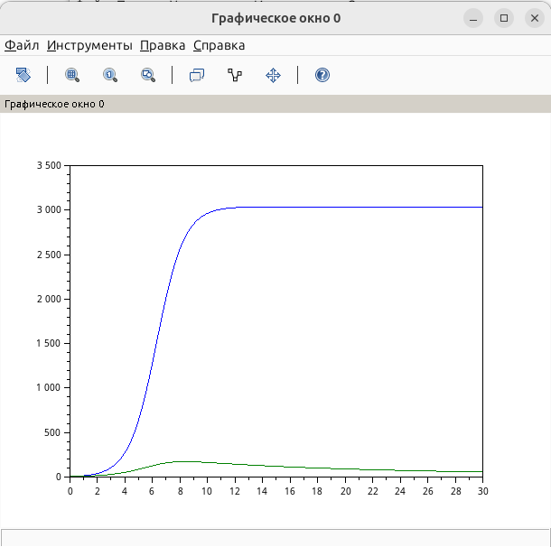

---
## Author
author:
  name: Швецов Михаил Романович
  degrees: Student
  email: 1132236100@rudn.ru
  affiliation:
    - name: Российский университет дружбы народов
      country: Российская Федерация
      postal-code: 117198
      city: Москва
      address: ул. Миклухо-Маклая, д. 6
## Title
title: Лабораторная работа 8
subtitle: Модель конкуренции двух фирм
license: CC BY
date: today
date-format: "YYYY-MM-DD" # Example: 2025-09-06
---

# Информация

## Докладчик

:::::::::::::: {.columns align=center}
::: {.column width="70%"}

  * Швецов Михаил Романович
  * студент НКНбд-01-23
  * Российский университет дружбы народов им. П. Лумумбы
  * [1132236100@rudn.ru](mailto:1132236100@rudn.ru)
  * <https://DarkkLord.github.io/ru/>

:::
::: {.column width="30%"}

:::
::::::::::::::

# Вводная часть

## Актуальность

- Решение задачи на эффективность рекламы. 

::: notes
- Почему именно *структура* презентации важна.
- Время: не более 1 минуты на этот слайд.
:::

## Объект исследования

Рассмотрим две фирмы, производящие взаимозаменяемые товары одинакового качества и находящиеся в одной рыночной нише.

Для обоих случаев заданы следующие начальные условия и параметры:

$$
M_1^0=5.5,\qquad M_2^0=5,
$$

$$
p_{cr}=35,\qquad N=41,\qquad q=1,
$$

$$
\tau_1=14,\qquad \tau_2=7,
$$

$$
\tilde{p}_1=6.5,\qquad \tilde{p}_2=15.
$$

## Объект исследования

Необходимо:

1. Построить графики изменения оборотных средств фирмы 1 и фирмы 2 без учета постоянных издержек и с введенной нормировкой для **случая 1**.

2. Построить графики изменения оборотных средств фирмы 1 и фирмы 2 без учета постоянных издержек и с введенной нормировкой для **случая 2**.

3. Проанализировать полученные результаты.

4. Найти стационарное состояние системы для первого случая.

где:

- $N$ — число потребителей производимого продукта;
- $\tau$ — длительность производственного цикла;
- $p$ — рыночная цена товара;
- $\tilde{p}$ — себестоимость продукта, то есть переменные издержки на производство единицы продукции;
- $q$ — максимальная потребность одного человека в продукте в единицу времени;
- $\theta=\frac{t}{c_1}$ — безразмерное время.

## Объект исследования

В первом случае конкуренция между фирмами осуществляется только рыночными
методами, поэтому коэффициент взаимодействия перед произведением
$M_1M_2$ является одинаковым для обеих фирм.

Во втором случае дополнительно учитываются социально-психологические
факторы, влияющие на предпочтение одного товара другому. В результате
коэффициент взаимодействия между фирмами изменяется.

## Объект и предмет исследования

Решение задачи об эпидемии, вариант 41. 

## Методы исследования

Основным методом является изучение теоретического материала и наработака практического навыка. 

# Теоретическая часть

Теоретическую часть мы можем изучить в файле задания лабораторной раюоты в соответствующем разделе ТУИС. 

# Выполнение лабораторной работы

## Выполнение лабораторной работы

В работе рассматривается математическая модель конкуренции двух фирм,
производящих взаимозаменяемые товары. Оборотные средства фирм
обозначаются через $M_1$ и $M_2$.

Для варианта 41 заданы начальные значения

$$
M_1(0)=5.5,\qquad M_2(0)=5.
$$

Параметры модели имеют следующие значения:

$$
p_{cr}=35,\qquad N=41,\qquad q=1,
$$

$$
\tau_1=14,\qquad \tau_2=7,
$$

$$
\tilde p_1=6.5,\qquad \tilde p_2=15.
$$

Значения $p_{cr}$, $\tilde p_1$, $\tilde p_2$ и $N$ задаются
в тысячах единиц, а значения $M_1$ и $M_2$ — в миллионах единиц.

## Выполнение лабораторной работы

Для расчёта коэффициентов системы используются формулы:

$$
a_1=
\frac{p_{cr}}
{\tau_1^2\tilde p_1^2Nq},
$$

$$
a_2=
\frac{p_{cr}}
{\tau_2^2\tilde p_2^2Nq},
$$

$$
b=
\frac{p_{cr}}
{\tau_1^2\tau_2^2
\tilde p_1^2\tilde p_2^2Nq},
$$

$$
c_1=
\frac{p_{cr}-\tilde p_1}
{\tau_1\tilde p_1},
\qquad
c_2=
\frac{p_{cr}-\tilde p_2}
{\tau_2\tilde p_2}.
$$

## Выполнение лабораторной работы

После подстановки параметров варианта 41 получаем:

$$
a_1\approx0.0001030864,
$$

$$
a_2\approx0.00007742935,
$$

$$
b\approx9.350241\cdot10^{-9},
$$

$$
c_1\approx0.3131868,
$$

$$
c_2\approx0.1904762.
$$

### Случай 1

В первом случае влияние фирм друг на друга определяется одинаковым
коэффициентом перед произведением $M_1M_2$.

## Выполнение лабораторной работы

Система имеет вид

$$
\frac{dM_1}{d\theta}
=
M_1-\frac{b}{c_1}M_1M_2
-\frac{a_1}{c_1}M_1^2,
$$

$$
\frac{dM_2}{d\theta}
=
\frac{c_2}{c_1}M_2
-\frac{b}{c_1}M_1M_2
-\frac{a_2}{c_1}M_2^2.
$$

Для решения системы используется численный метод решения
обыкновенных дифференциальных уравнений `ode`.

Полученный график показывает изменение оборотных средств двух фирм
во времени. В процессе развития системы оборотные средства фирм
изменяются, после чего стремятся к устойчивым значениям.

Для варианта 41 стационарное состояние первого случая составляет
примерно

$$
M_1^*\approx3037.88,
\qquad
M_2^*\approx2459.63.
$$

## Выполнение лабораторной работы

### Случай 2

Во втором случае дополнительно учитывается социально-психологическое
влияние товаров фирм друг на друга.

Для второй фирмы коэффициент перед $M_1M_2$ увеличивается на $0.00021$:

$$
\frac{dM_2}{d\theta}
=
\frac{c_2}{c_1}M_2
-
\left(\frac{b}{c_1}+0.00021\right)M_1M_2
-
\frac{a_2}{c_1}M_2^2.
$$

## Выполнение лабораторной работы

Таким образом, взаимодействие фирм во втором случае отличается
от первого. Это приводит к изменению динамики оборотных средств
предприятий и позволяет исследовать влияние дополнительного
социально-психологического фактора на конкуренцию.

# Непосредственное выполнение

## Скриншоты с пояснениями к действиям 

График для случая 1  (рис. -@fig-001).

{#fig-001 width=40%}

## Скриншоты с пояснениями к действиям 

График для случая 2 (рис. -@fig-002).

{#fig-002 width=40%}

# Заключение

## Главный вывод

В ходе лабораторной работы была рассмотрена математическая модель конкуренции двух фирм, производящих взаимозаменяемые товары. Для варианта 41 были заданы начальные значения оборотных средств фирм и параметры модели.

Были рассмотрены два случая конкуренции. В первом случае коэффициент взаимодействия фирм одинаков для обеих компаний. Полученный график показывает изменение оборотных средств фирм во времени и их стремление к устойчивым значениям.

Во втором случае учитывается дополнительный социально-психологический фактор, вследствие чего коэффициент взаимодействия фирм изменяется. Это приводит к изменению динамики оборотных средств по сравнению с первым случаем.

Таким образом, результаты моделирования показывают, что изменение характера взаимодействия между конкурирующими фирмами существенно влияет на динамику их оборотных средств и положение фирм на рынке.
