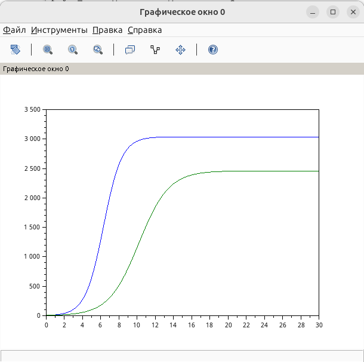

---
## Author
author:
  name: Швецов Михаил Романович
  degrees: Student
  email: 1132236100rudn.ru
  affiliation:
    - name: Российский университет дружбы народов
      country: Российская Федерация
      postal-code: 117198
      city: Москва
      address: ул. Миклухо-Маклая, д. 6

## Title
title: "Отчёт по лабораторной работе 8"
subtitle: "Модель конкуренции двух фирм"
license: "CC BY"
abstract: |
  В данном отчёте представлены результаты выполнения лабораторной работы по теме "Модель конкуренции двух фирм"
  Описаны использованные методы, полученные экспериментальные данные и их анализ.

  Сделаны выводы о достижении поставленной цели.
keywords: [лабораторная работа, шаблон, Markdown, Pandoc]
---

# Введение

## Актуальность

В данной работе мы решили задачу "Модель конкуренции двух фирм" по предоставленному примеру решения. 

## Цель работы

Решить представленную зачаду в указанном варианте.

## Задачи

Рассмотрим две фирмы, производящие взаимозаменяемые товары одинакового качества и находящиеся в одной рыночной нише.

Для обоих случаев заданы следующие начальные условия и параметры:

$$
M_1^0=5.5,\qquad M_2^0=5,
$$

$$
p_{cr}=35,\qquad N=41,\qquad q=1,
$$

$$
\tau_1=14,\qquad \tau_2=7,
$$

$$
\tilde{p}_1=6.5,\qquad \tilde{p}_2=15.
$$

Необходимо:

1. Построить графики изменения оборотных средств фирмы 1 и фирмы 2 без учета постоянных издержек и с введенной нормировкой для **случая 1**.

2. Построить графики изменения оборотных средств фирмы 1 и фирмы 2 без учета постоянных издержек и с введенной нормировкой для **случая 2**.

3. Проанализировать полученные результаты.

4. Найти стационарное состояние системы для первого случая.

где:

- $N$ — число потребителей производимого продукта;
- $\tau$ — длительность производственного цикла;
- $p$ — рыночная цена товара;
- $\tilde{p}$ — себестоимость продукта, то есть переменные издержки на производство единицы продукции;
- $q$ — максимальная потребность одного человека в продукте в единицу времени;
- $\theta=\frac{t}{c_1}$ — безразмерное время.

В первом случае конкуренция между фирмами осуществляется только рыночными
методами, поэтому коэффициент взаимодействия перед произведением
$M_1M_2$ является одинаковым для обеих фирм.

Во втором случае дополнительно учитываются социально-психологические
факторы, влияющие на предпочтение одного товара другому. В результате
коэффициент взаимодействия между фирмами изменяется.

## Объект и предмет исследования

Решение задачи, вариант 41. 

## Методы исследования

Основным методом является изучение теоретического материала и наработака практического навыка. 

# Теоретическая часть

Теоретическую часть мы можем изучить в файле задания лабораторной раюоты в соответствующем разделе ТУИС. 

# Выполнение лабораторной работы

## Пояснение

В работе рассматривается математическая модель конкуренции двух фирм,
производящих взаимозаменяемые товары. Оборотные средства фирм
обозначаются через $M_1$ и $M_2$.

Для варианта 41 заданы начальные значения

$$
M_1(0)=5.5,\qquad M_2(0)=5.
$$

Параметры модели имеют следующие значения:

$$
p_{cr}=35,\qquad N=41,\qquad q=1,
$$

$$
\tau_1=14,\qquad \tau_2=7,
$$

$$
\tilde p_1=6.5,\qquad \tilde p_2=15.
$$

Значения $p_{cr}$, $\tilde p_1$, $\tilde p_2$ и $N$ задаются
в тысячах единиц, а значения $M_1$ и $M_2$ — в миллионах единиц.

Для расчёта коэффициентов системы используются формулы:

$$
a_1=
\frac{p_{cr}}
{\tau_1^2\tilde p_1^2Nq},
$$

$$
a_2=
\frac{p_{cr}}
{\tau_2^2\tilde p_2^2Nq},
$$

$$
b=
\frac{p_{cr}}
{\tau_1^2\tau_2^2
\tilde p_1^2\tilde p_2^2Nq},
$$

$$
c_1=
\frac{p_{cr}-\tilde p_1}
{\tau_1\tilde p_1},
\qquad
c_2=
\frac{p_{cr}-\tilde p_2}
{\tau_2\tilde p_2}.
$$

После подстановки параметров варианта 41 получаем:

$$
a_1\approx0.0001030864,
$$

$$
a_2\approx0.00007742935,
$$

$$
b\approx9.350241\cdot10^{-9},
$$

$$
c_1\approx0.3131868,
$$

$$
c_2\approx0.1904762.
$$

### Случай 1

В первом случае влияние фирм друг на друга определяется одинаковым
коэффициентом перед произведением $M_1M_2$.

Система имеет вид

$$
\frac{dM_1}{d\theta}
=
M_1-\frac{b}{c_1}M_1M_2
-\frac{a_1}{c_1}M_1^2,
$$

$$
\frac{dM_2}{d\theta}
=
\frac{c_2}{c_1}M_2
-\frac{b}{c_1}M_1M_2
-\frac{a_2}{c_1}M_2^2.
$$

Для решения системы используется численный метод решения
обыкновенных дифференциальных уравнений `ode`.

Полученный график показывает изменение оборотных средств двух фирм
во времени. В процессе развития системы оборотные средства фирм
изменяются, после чего стремятся к устойчивым значениям.

Для варианта 41 стационарное состояние первого случая составляет
примерно

$$
M_1^*\approx3037.88,
\qquad
M_2^*\approx2459.63.
$$

### Случай 2

Во втором случае дополнительно учитывается социально-психологическое
влияние товаров фирм друг на друга.

Для второй фирмы коэффициент перед $M_1M_2$ увеличивается на $0.00021$:

$$
\frac{dM_2}{d\theta}
=
\frac{c_2}{c_1}M_2
-
\left(\frac{b}{c_1}+0.00021\right)M_1M_2
-
\frac{a_2}{c_1}M_2^2.
$$

Таким образом, взаимодействие фирм во втором случае отличается
от первого. Это приводит к изменению динамики оборотных средств
предприятий и позволяет исследовать влияние дополнительного
социально-психологического фактора на конкуренцию.

## Вывод

В ходе лабораторной работы была рассмотрена математическая модель конкуренции двух фирм, производящих взаимозаменяемые товары. Для варианта 41 были заданы начальные значения оборотных средств фирм и параметры модели.

Были рассмотрены два случая конкуренции. В первом случае коэффициент взаимодействия фирм одинаков для обеих компаний. Полученный график показывает изменение оборотных средств фирм во времени и их стремление к устойчивым значениям.

Во втором случае учитывается дополнительный социально-психологический фактор, вследствие чего коэффициент взаимодействия фирм изменяется. Это приводит к изменению динамики оборотных средств по сравнению с первым случаем.

Таким образом, результаты моделирования показывают, что изменение характера взаимодействия между конкурирующими фирмами существенно влияет на динамику их оборотных средств и положение фирм на рынке.

# Скриншоты выполнения лабораторной работы

График для случая 1  (рис. -@fig-001).

{#fig-001 width=70%}

График для случая 2 (рис. -@fig-002).

{#fig-002 width=70%}

# Заключение

- Достигнута поставленная цель;
- Решена предоставленная задача, а также изчуна теоретическая часть.

# Список литературы {.unnumbered}

::: {#refs}

1. Knuth D.E. Literate Programming // The Computer Journal. Oxford University Press (OUP), 1984. Т. 27, № 2. С. 97–111.
2. Schulte E. и др. A Multi-Language Computing Environment for Literate Programming and Reproducible Research // Journal of Statistical Software. Foundation for Open Access Statistic, 2012. Т. 46, № 3.
3. Kery M.B. и др. The Story in the Notebook // Proceedings of the 2018 CHI Conference on Human Factors in Computing Systems. ACM, 2018. С. 1–11.

:::

\appendix

# Приложения {.appendix}

Приложение А. Листинг кода для решения задачи (SciLab).

```

p_cr = 35; //критическая стоимость продукта
tau1 = 14; //длительность производственного цикла фирмы 1
p1 = 6.5; //себестоимость продукта у фирмы 1
tau2 = 7; //длительность производственного цикла фирмы 2
p2 = 15; //себестоимость продукта у фирмы 2
V = 41; //число потребителей производимого продукта
q = 1; //максимальная потребность одного человека в продукте в 
// единицу времени

a1 = p_cr/(tau1*tau1*p1*p1*V*q);
a2 = p_cr/(tau2*tau2*p2*p2*V*q);
b = p_cr/(tau1*tau1*tau2*tau2*p1*p1*p2*p2*V*q);
c1 = (p_cr-p1)/(tau1*p1);
c2 = (p_cr-p2)/(tau2*p2);

function dx=syst(t, x)
dx(1) = (c1/c1)*x(1) - (a1/c1)*x(1)*x(1) - (b/c1)*x(1)*x(2);
dx(2) = (c2/c1)*x(2) - (a2/c1)*x(2)*x(2) - (b/c1)*x(1)*x(2);
endfunction

t0 = 0;
x0=[5.5;5]; //начальное значение объема оборотных средств x1 и х2
t = [0: 0.01: 30];
y = ode(x0, t0, t, syst);
n = size(y, "c");
plot(t, y); //построение динамики изменения оборотных средств фирмы 
// 1 и фирмы 2

```

Приложение В. Листинг кода для решения задачи (SciLab).

```

p_cr = 35; //критическая стоимость продукта
tau1 = 14; //длительность производственного цикла фирмы 1
p1 = 6.5; //себестоимость продукта у фирмы 1
tau2 = 7; //длительность производственного цикла фирмы 2
p2 = 15; //себестоимость продукта у фирмы 2
V = 41; //число потребителей производимого продукта
q = 1; //максимальная потребность одного человека в продукте в 
// единицу времени

a1 = p_cr/(tau1*tau1*p1*p1*V*q);
a2 = p_cr/(tau2*tau2*p2*p2*V*q);
b = p_cr/(tau1*tau1*tau2*tau2*p1*p1*p2*p2*V*q);
c1 = (p_cr-p1)/(tau1*p1);
c2 = (p_cr-p2)/(tau2*p2);

function dx=syst(t, x)
dx(1) = (c1/c1)*x(1) - (a1/c1)*x(1)*x(1) - (b/c1)*x(1)*x(2);
dx(2) = (c2/c1)*x(2) - ((b/c1)+0.00021)*x(1)*x(2) - (a2/c1)*x(2)*x(2);
endfunction

t0 = 0;
x0=[5.5;5]; //начальное значение объема оборотных средств x1 и х2
t = [0: 0.01: 30];
y = ode(x0, t0, t, syst);
n = size(y, "c");
plot(t, y); //построение динамики изменения оборотных средств фирмы 
// 1 и фирмы 2

```
